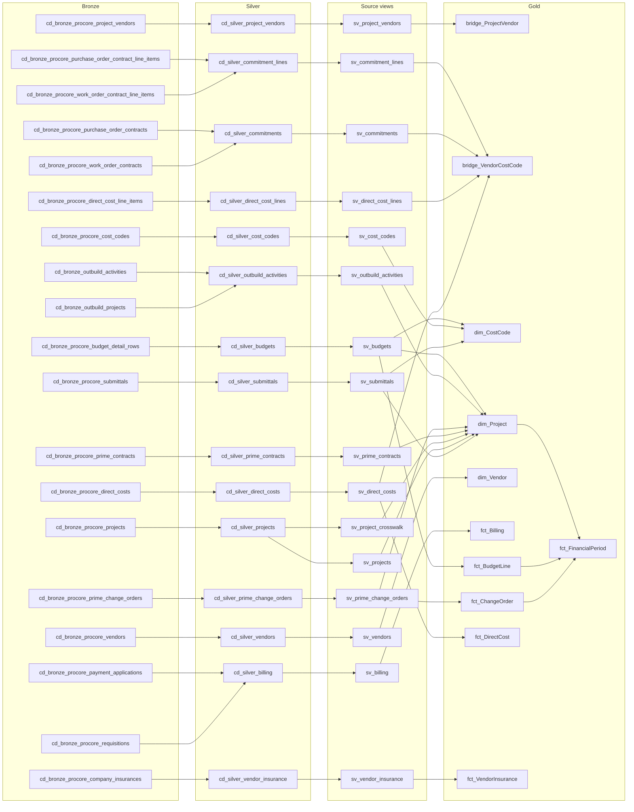
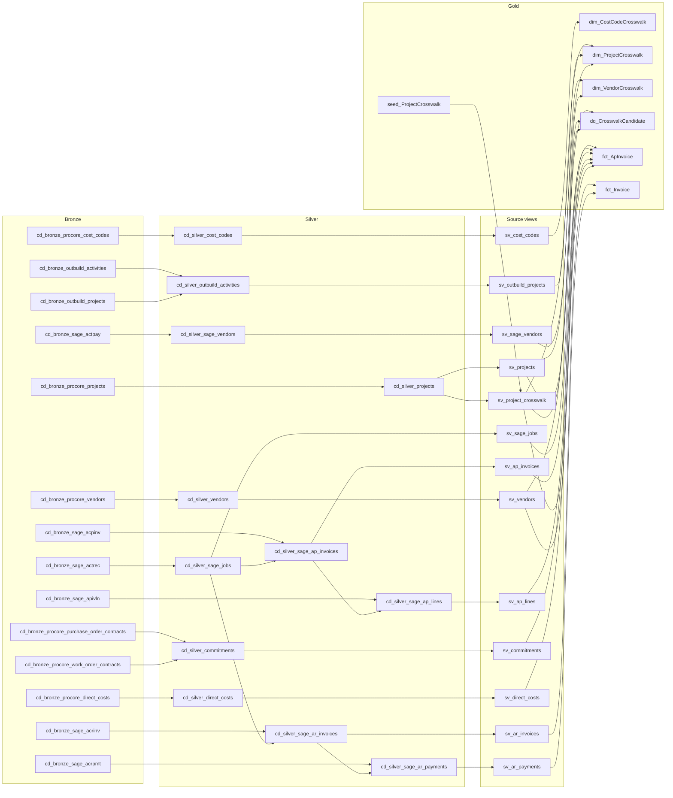
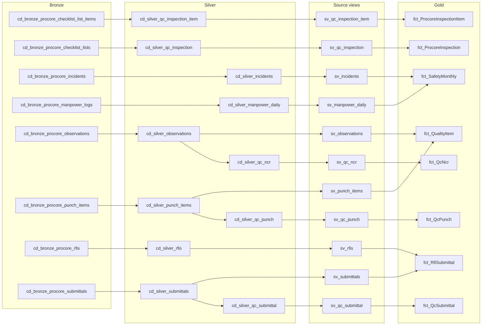
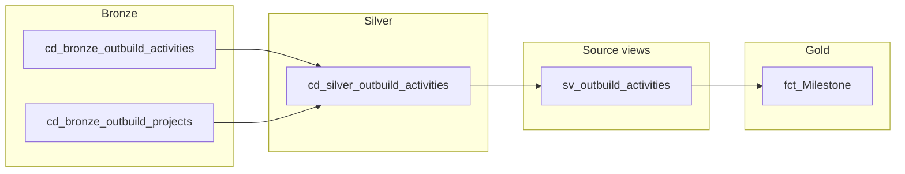
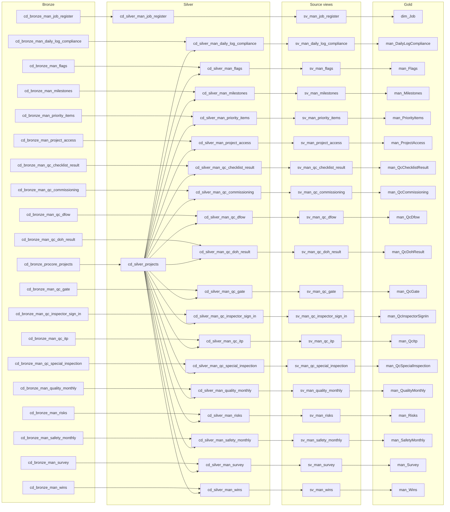

# Data dictionary

Generated by `_local/make_data_dictionary.py` - do not edit by hand. CI runs `--check`, so a SQL, DQ or model change without regenerating fails the build.

67 gold tables, 179 measures across 2 semantic models, 217 DQ rules.

Sources: SQL header comments (purpose, grain), `02-transformation/dq/expectations.py` (keys, rules), committed TMDL (types), `deploy_model*.py` (models, relationships, DAX), `_docs/report-lineage.json` (visual bindings - regenerate with `audit_solution.py`).

## Contents

- **Procore financial**: [bridge_ProjectVendor](#bridge_projectvendor), [bridge_VendorCostCode](#bridge_vendorcostcode), [dim_CostCode](#dim_costcode), [dim_Project](#dim_project), [dim_Vendor](#dim_vendor), [fct_Billing](#fct_billing), [fct_BudgetLine](#fct_budgetline), [fct_ChangeOrder](#fct_changeorder), [fct_DirectCost](#fct_directcost), [fct_FinancialPeriod](#fct_financialperiod), [fct_VendorInsurance](#fct_vendorinsurance)
- **Sage AR/AP**: [dim_CostCodeCrosswalk](#dim_costcodecrosswalk), [dim_ProjectCrosswalk](#dim_projectcrosswalk), [dim_VendorCrosswalk](#dim_vendorcrosswalk), [dq_CrosswalkCandidate](#dq_crosswalkcandidate), [fct_ApInvoice](#fct_apinvoice), [fct_Invoice](#fct_invoice), [seed_ProjectCrosswalk](#seed_projectcrosswalk)
- **Quality**: [fct_ProcoreInspection](#fct_procoreinspection), [fct_ProcoreInspectionItem](#fct_procoreinspectionitem), [fct_QcNcr](#fct_qcncr), [fct_QcPunch](#fct_qcpunch), [fct_QcSubmittal](#fct_qcsubmittal), [fct_QualityItem](#fct_qualityitem), [fct_RfiSubmittal](#fct_rfisubmittal), [fct_SafetyMonthly](#fct_safetymonthly)
- **Schedule**: [fct_Milestone](#fct_milestone)
- **Manual registers**: [dim_Job](#dim_job), [man_DailyLogCompliance](#man_dailylogcompliance), [man_Flags](#man_flags), [man_Milestones](#man_milestones), [man_PriorityItems](#man_priorityitems), [man_ProjectAccess](#man_projectaccess), [man_QcChecklistResult](#man_qcchecklistresult), [man_QcCommissioning](#man_qccommissioning), [man_QcDfow](#man_qcdfow), [man_QcDohResult](#man_qcdohresult), [man_QcGate](#man_qcgate), [man_QcInspectorSignIn](#man_qcinspectorsignin), [man_QcItp](#man_qcitp), [man_QcSpecialInspection](#man_qcspecialinspection), [man_QualityMonthly](#man_qualitymonthly), [man_Risks](#man_risks), [man_SafetyMonthly](#man_safetymonthly), [man_Survey](#man_survey), [man_Wins](#man_wins)
- **Shared and platform tables**: [dim_ActivityCategory](#dim_activitycategory), [dim_Date](#dim_date), [dim_Owner](#dim_owner), [dim_QcStatus](#dim_qcstatus), [dim_ScorecardBand](#dim_scorecardband), [dim_ScorecardWeight](#dim_scorecardweight), [dim_Status](#dim_status), [dim_Trade](#dim_trade), [dq_DataGap](#dq_datagap), [dq_TradeMappingCandidate](#dq_trademappingcandidate), [fct_DailySnapshot](#fct_dailysnapshot), [measures_anchor](#measures_anchor), [meta_PipelineRun](#meta_pipelinerun), [meta_SourceFreshness](#meta_sourcefreshness), [qc_seed_ChecklistItem](#qc_seed_checklistitem), [qc_seed_DohItem](#qc_seed_dohitem), [qc_seed_Gate](#qc_seed_gate), [qc_seed_Trade](#qc_seed_trade), [qc_seed_TradeAlias](#qc_seed_tradealias), [qc_seed_TradeSynonymProposal](#qc_seed_tradesynonymproposal), [seed_KpiCatalog](#seed_kpicatalog)
- [Known gaps and business decisions](#known-gaps-and-business-decisions)

## Lineage by subject area

Layers left to right: bronze, silver, source views (`sv_*`), gold. Intermediate silver views are collapsed; gold tables from other subject areas are omitted (see each table's upstream list).

### Procore financial

### Sage AR/AP

### Quality

### Schedule

### Manual registers

## Tables

### bridge_ProjectVendor

- **Subject area:** Procore financial
- **Purpose:** which vendors are on which projects, with prequal detail.
- **Grain:** Not stated in the SQL comments.
- **Primary key:** (ProjectKey, VendorKey) (DQ unique rule)
- **Produced by:** `02-transformation/sql/gold/29_bridge_projectvendor.sql`
- **Upstream:** source views: `sv_project_vendors`; silver: `cd_silver_project_vendors`; bronze: `cd_bronze_procore_project_vendors`
- **Semantic models:** Affect Project Report
- **Relationships:** bridge_ProjectVendor[ProjectKey] -> dim_Project[ProjectKey]
- **Measures referencing it (Affect Project Report):** Certificates Expiring Soon, Certificates On File, Expired Certificates, Vendors Missing From ERP, Vendors On Project, Vendors With Insurance, Vendors Without Insurance
- **Report usage (Monthly Progress Report):** Direct Costs & Vendors (3 visuals), Portfolio (1 visual), Vendor Insurance (10 visuals)

| DQ rule | Severity |
|---|---|
| bridge_ProjectVendor.ProjectKey.fk_dim_Project | error |
| bridge_ProjectVendor.ProjectKey_VendorKey.unique | error |
| vendors on a project have a certificate on file | warn |

| Column | Type | Type source |
|---|---|---|
| ProjectKey | string | TMDL |
| VendorKey | string | TMDL |
| VendorName | string | TMDL |
| TradeName | string | TMDL |
| City | string | TMDL |
| StateCode | string | TMDL |
| BusinessPhone | string | TMDL |
| EmailAddress | string | TMDL |
| LicenseNumber | string | TMDL |
| LaborUnion | string | TMDL |
| IsPrequalified | boolean | TMDL |
| IsActive | boolean | TMDL |
| IsUnionMember | boolean | TMDL |
| SyncedToErp | boolean | TMDL |
| IsMissingFromErp | boolean | TMDL |

### bridge_VendorCostCode

- **Subject area:** Procore financial
- **Purpose:** what each vendor is spent with, and committed to, per cost code.
- **Grain:** (project, vendor, cost code, amount type).
- **Primary key:** (VendorCostCodeKey) (DQ unique rule)
- **Produced by:** `02-transformation/sql/gold/31_bridge_vendorcostcode.sql`
- **Upstream:** source views: `sv_commitment_lines`, `sv_commitments`, `sv_direct_cost_lines`, `sv_direct_costs`; silver: `cd_silver_commitment_lines`, `cd_silver_commitments`, `cd_silver_direct_cost_lines`, `cd_silver_direct_costs`; bronze: `cd_bronze_procore_direct_cost_line_items`, `cd_bronze_procore_direct_costs`, `cd_bronze_procore_purchase_order_contract_line_items`, `cd_bronze_procore_purchase_order_contracts`, `cd_bronze_procore_work_order_contract_line_items`, `cd_bronze_procore_work_order_contracts`
- **Semantic models:** Affect Project Report
- **Relationships:** bridge_VendorCostCode[CostCodeKey] -> dim_CostCode[CostCodeKey]; bridge_VendorCostCode[ProjectKey] -> dim_Project[ProjectKey]; bridge_VendorCostCode[VendorKey] -> dim_Vendor[VendorKey]
- **Measures referencing it (Affect Project Report):** Cost Codes Per Vendor, Vendor Committed, Vendor Spend, Vendors Per Cost Code
- **Report usage (Monthly Progress Report):** Direct Costs & Vendors (3 visuals)

| DQ rule | Severity |
|---|---|
| bridge actual spend does not exceed direct cost spend | error |
| bridge committed equals non-void, non-draft commitment lines | error |
| bridge_VendorCostCode.CostCodeKey.fk_dim_CostCode | error |
| bridge_VendorCostCode.CostCodeKey.not_null | error |
| bridge_VendorCostCode.ProjectKey.fk_dim_Project | error |
| bridge_VendorCostCode.VendorCostCodeKey.unique | error |
| bridge_VendorCostCode.VendorKey.fk_dim_Vendor | warn |
| bridge_VendorCostCode.VendorKey.not_null | error |
| committed lines are not negative | warn |
| terminated commitments counted at full value in vendor committed | warn |
| the vendor bridge covers most direct cost spend | warn |

| Column | Type | Type source |
|---|---|---|
| VendorCostCodeKey | string | TMDL |
| ProjectKey | string | TMDL |
| VendorKey | string | TMDL |
| VendorName | string | TMDL |
| CostCodeKey | string | TMDL |
| CostCode | string | TMDL |
| CostCodeName | string | TMDL |
| AmountType | string | TMDL |
| SourceLabel | string | TMDL |
| Amount | double | TMDL |
| LineItemCount | int64 | TMDL |
| ParentCount | int64 | TMDL |
| IsActual | boolean | TMDL |

### dim_ActivityCategory

- **Subject area:** Shared and platform tables
- **Purpose:** safety (DROPDOWN!I, 16) + quality (DROPDOWN!K, 11) = 27.
- **Grain:** Not stated in the SQL comments.
- **Primary key:** No DQ unique rule.
- **Produced by:** `02-transformation/sql/gold/04_dim_activitycategory.sql`
- **Upstream:** none (inline values or no SQL)
- **Semantic models:** Affect Project Report
- **Relationships:** none

| Column | Type | Type source |
|---|---|---|
| CategoryKey | int64 | TMDL |
| Domain | string | TMDL |
| CategoryType | string | TMDL |
| CategoryQualifier | string | TMDL |
| FullLabel | string | TMDL |

### dim_CostCode

- **Subject area:** Procore financial
- **Purpose:** dim_CostCode.
- **Grain:** Not stated in the SQL comments.
- **Primary key:** (CostCodeKey) (DQ unique rule)
- **Produced by:** `02-transformation/sql/gold/12_dim_costcode.sql`
- **Upstream:** source views: `sv_budgets`, `sv_cost_codes`, `sv_submittals`; silver: `cd_silver_budgets`, `cd_silver_cost_codes`, `cd_silver_submittals`; bronze: `cd_bronze_procore_budget_detail_rows`, `cd_bronze_procore_cost_codes`, `cd_bronze_procore_submittals`
- **Semantic models:** Affect Project Report
- **Relationships:** bridge_VendorCostCode[CostCodeKey] -> dim_CostCode[CostCodeKey]; fct_BudgetLine[CostCodeKey] -> dim_CostCode[CostCodeKey]; fct_RfiSubmittal[CostCodeKey] -> dim_CostCode[CostCodeKey]
- **Measures referencing it (Affect Project Report):** DQ Cost Codes Not In Source
- **Report usage (Monthly Progress Report):** Data Quality (1 visual), Financial (1 visual), Overview (1 visual), Project Detail (1 visual)

| DQ rule | Severity |
|---|---|
| dim_CostCode.CostCodeKey.unique | error |
| dim_CostCode.Division is two digits or NULL | error |

| Column | Type | Type source |
|---|---|---|
| CostCodeKey | string | TMDL |
| CostCode | string | TMDL |
| Description | string | TMDL |
| Division | string | TMDL |
| IsInSource | boolean | TMDL |

### dim_CostCodeCrosswalk

- **Subject area:** Sage AR/AP
- **Purpose:** cost codes across Procore and Sage, with the division rollup the report groups by.
- **Grain:** Not stated in the SQL comments.
- **Primary key:** (CostCodeKey) (DQ unique rule)
- **Produced by:** `02-transformation/sql/gold/17_dim_costcodecrosswalk.sql`
- **Upstream:** source views: `sv_cost_codes`; silver: `cd_silver_cost_codes`; bronze: `cd_bronze_procore_cost_codes`
- **Semantic models:** Affect Project Report
- **Relationships:** none
- **Report usage (Monthly Progress Report):** Source Coverage (1 visual)

| DQ rule | Severity |
|---|---|
| cost codes parse to a CSI division | warn |
| dim_CostCodeCrosswalk.CostCodeKey.unique | error |

| Column | Type | Type source |
|---|---|---|
| CostCodeKey | string | TMDL |
| ProcoreCostCodeId | string | TMDL |
| CostCode | string | TMDL |
| CostCodeName | string | TMDL |
| DivisionCode | string | TMDL |
| SageCostCode | string | TMDL |
| IsInSage | boolean | TMDL |
| SageMatchMethod | string | TMDL |
| IsInProcore | boolean | TMDL |
| HasUnparseableCode | boolean | TMDL |

### dim_Date

- **Subject area:** Shared and platform tables
- **Purpose:** the contiguous calendar, marked as the date table in the model.
- **Grain:** Not stated in the SQL comments.
- **Primary key:** (Date) (DQ unique rule)
- **Produced by:** `02-transformation/sql/gold/00_dim_date.sql`
- **Upstream:** none (inline values or no SQL)
- **Semantic models:** Affect Project Report, Project Quality Plan
- **Relationships:** fct_ApInvoice[MonthStart] -> dim_Date[Date]; fct_Billing[MonthStart] -> dim_Date[Date]; fct_BudgetLine[MonthStart] -> dim_Date[Date]; fct_ChangeOrder[MonthStart] -> dim_Date[Date]; fct_DailySnapshot[SnapshotDate] -> dim_Date[Date]; fct_DirectCost[MonthStart] -> dim_Date[Date]; fct_FinancialPeriod[MonthStart] -> dim_Date[Date]; fct_Invoice[MonthStart] -> dim_Date[Date]; fct_Milestone[MonthStart] -> dim_Date[Date]; fct_ProcoreInspection[InspectionDate] -> dim_Date[Date]; fct_QcNcr[MonthStart] -> dim_Date[Date]; fct_QcPunch[MonthStart] -> dim_Date[Date]; fct_QcSubmittal[MonthStart] -> dim_Date[Date]; fct_QualityItem[MonthStart] -> dim_Date[Date]; fct_RfiSubmittal[MonthStart] -> dim_Date[Date]; fct_SafetyMonthly[MonthStart] -> dim_Date[Date]; man_DailyLogCompliance[MonthStart] -> dim_Date[Date]; man_Flags[MonthStart] -> dim_Date[Date]; man_PriorityItems[MonthStart] -> dim_Date[Date]; man_QualityMonthly[MonthStart] -> dim_Date[Date]; man_Risks[MonthStart] -> dim_Date[Date]; man_SafetyMonthly[MonthStart] -> dim_Date[Date]; man_Survey[MonthStart] -> dim_Date[Date]; man_Wins[MonthStart] -> dim_Date[Date]
- **Measures referencing it (Affect Project Report):** Billed Cumulative, Budget, Cash Received, Committed, Cost To Complete, Current Contract, Forecast, Original Contract, Pending Change Orders, Report Month Label, Spent To Date, Total Billed %, Total Billed MoM %
- **Report usage (Monthly Progress Report):** Billing & Retainage (3 visuals), Data Quality (2 visuals), Direct Costs & Vendors (4 visuals), Financial (9 visuals), KPI Definitions (2 visuals), Overview (7 visuals), Portfolio (5 visuals), Project Detail (3 visuals), Safety & Quality (2 visuals), Schedule & Quality (3 visuals), Scorecard (2 visuals), Source Coverage (2 visuals), Vendor Insurance (2 visuals)
- **Measures referencing it (Project Quality Plan):** Report Month Label
- **Report usage (Project Quality Plan):** Data Quality (2 visuals), Inspection Items (2 visuals), KPI Definitions (2 visuals), Observations (3 visuals), Procore Inspections (2 visuals), Punch & Completion (2 visuals), Quality Portfolio (2 visuals), Statutory Gates (2 visuals), Submittals & Mock-Ups (2 visuals), Trade Checklists & DFOW (2 visuals), Trade Mapping Decisions (2 visuals)

| DQ rule | Severity |
|---|---|
| dim_Date.Date.unique | error |

| Column | Type | Type source |
|---|---|---|
| Date | dateTime | TMDL |
| Year | int64 | TMDL |
| Quarter | int64 | TMDL |
| Month | int64 | TMDL |
| Day | int64 | TMDL |
| MonthStart | dateTime | TMDL |
| MonthEnd | dateTime | TMDL |
| MonthName | string | TMDL |
| MonthYear | string | TMDL |
| MonthYearSort | int64 | TMDL |
| MonthOffset | int64 | TMDL |
| IsMonthEnd | boolean | TMDL |

### dim_Job

- **Subject area:** Manual registers
- **Purpose:** the job pipeline, from "somebody asked for it" to "it went to bid".
- **Grain:** Not stated in the SQL comments.
- **Primary key:** (JobNumber) (DQ unique rule)
- **Produced by:** `02-transformation/sql/gold/13_dim_job.sql`
- **Upstream:** source views: `sv_man_job_register`; silver: `cd_silver_man_job_register`; bronze: `cd_bronze_man_job_register`
- **Semantic models:** none
- **Relationships:** none

| DQ rule | Severity |
|---|---|
| dim_Job.JobNumber.issued_past_requested | warn |
| dim_Job.JobNumber.unique | error |

| Column | Type | Type source |
|---|---|---|
| RegisterId | INT | SQL DDL |
| JobNumber | STRING | SQL DDL |
| JobYear | INT | SQL DDL |
| JobSeq | INT | SQL DDL |
| ProjectName | STRING | SQL DDL |
| Stage | STRING | SQL DDL |
| EstimatingFolderUrl | STRING | SQL DDL |
| ProjectFolderUrl | STRING | SQL DDL |
| RequestedBy | STRING | SQL DDL |
| RequestedAt | TIMESTAMP | SQL DDL |
| CompletedAt | TIMESTAMP | SQL DDL |
| CopyJobStatus | STRING | SQL DDL |
| ErrorDetail | STRING | SQL DDL |
| LastModified | TIMESTAMP | SQL DDL |
| LastModifiedBy | STRING | SQL DDL |

### dim_Owner

- **Subject area:** Shared and platform tables
- **Purpose:** the 9 roles from DROPDOWN!C4:C12.
- **Grain:** Not stated in the SQL comments.
- **Primary key:** No DQ unique rule.
- **Produced by:** `02-transformation/sql/gold/03_dim_owner.sql`
- **Upstream:** none (inline values or no SQL)
- **Semantic models:** Affect Project Report
- **Relationships:** none

| Column | Type | Type source |
|---|---|---|
| OwnerKey | int64 | TMDL |
| RoleName | string | TMDL |
| SortOrder | int64 | TMDL |
| PersonName | string | TMDL |

### dim_Project

- **Subject area:** Procore financial
- **Purpose:** the spine every fact hangs off.
- **Grain:** Not stated in the SQL comments.
- **Primary key:** (ProjectKey) (DQ unique rule)
- **Produced by:** `02-transformation/sql/gold/10_dim_project.sql`
- **Upstream:** gold: `seed_ProjectCrosswalk`; source views: `sv_budgets`, `sv_outbuild_activities`, `sv_prime_change_orders`, `sv_prime_contracts`, `sv_project_crosswalk`, `sv_projects`, `sv_submittals`; silver: `cd_silver_budgets`, `cd_silver_outbuild_activities`, `cd_silver_prime_change_orders`, `cd_silver_prime_contracts`, `cd_silver_projects`, `cd_silver_submittals`; bronze: `cd_bronze_outbuild_activities`, `cd_bronze_outbuild_projects`, `cd_bronze_procore_budget_detail_rows`, `cd_bronze_procore_prime_change_orders`, `cd_bronze_procore_prime_contracts`, `cd_bronze_procore_projects`, `cd_bronze_procore_submittals`
- **Semantic models:** Affect Project Report, Project Quality Plan
- **Relationships:** bridge_ProjectVendor[ProjectKey] -> dim_Project[ProjectKey]; bridge_VendorCostCode[ProjectKey] -> dim_Project[ProjectKey]; dim_ProjectCrosswalk[ProjectKey] -> dim_Project[ProjectKey]; dq_DataGap[ProjectKey] -> dim_Project[ProjectKey]; fct_ApInvoice[ProjectKey] -> dim_Project[ProjectKey]; fct_Billing[ProjectKey] -> dim_Project[ProjectKey]; fct_BudgetLine[ProjectKey] -> dim_Project[ProjectKey]; fct_ChangeOrder[ProjectKey] -> dim_Project[ProjectKey]; fct_DailySnapshot[ProjectKey] -> dim_Project[ProjectKey]; fct_DirectCost[ProjectKey] -> dim_Project[ProjectKey]; fct_FinancialPeriod[ProjectKey] -> dim_Project[ProjectKey]; fct_Invoice[ProjectKey] -> dim_Project[ProjectKey]; fct_Milestone[ProjectKey] -> dim_Project[ProjectKey]; fct_ProcoreInspection[ProjectKey] -> dim_Project[ProjectKey]; fct_QcNcr[ProjectKey] -> dim_Project[ProjectKey]; fct_QcPunch[ProjectKey] -> dim_Project[ProjectKey]; fct_QcSubmittal[ProjectKey] -> dim_Project[ProjectKey]; fct_QualityItem[ProjectKey] -> dim_Project[ProjectKey]; fct_RfiSubmittal[ProjectKey] -> dim_Project[ProjectKey]; fct_SafetyMonthly[ProjectKey] -> dim_Project[ProjectKey]; man_DailyLogCompliance[ProjectKey] -> dim_Project[ProjectKey]; man_Flags[ProjectKey] -> dim_Project[ProjectKey]; man_Milestones[ProjectKey] -> dim_Project[ProjectKey]; man_PriorityItems[ProjectKey] -> dim_Project[ProjectKey]; man_QcChecklistResult[ProjectKey] -> dim_Project[ProjectKey]; man_QcCommissioning[ProjectKey] -> dim_Project[ProjectKey]; man_QcDfow[ProjectKey] -> dim_Project[ProjectKey]; man_QcDohResult[ProjectKey] -> dim_Project[ProjectKey]; man_QcGate[ProjectKey] -> dim_Project[ProjectKey]; man_QcInspectorSignIn[ProjectKey] -> dim_Project[ProjectKey]; man_QcItp[ProjectKey] -> dim_Project[ProjectKey]; man_QcSpecialInspection[ProjectKey] -> dim_Project[ProjectKey]; man_QualityMonthly[ProjectKey] -> dim_Project[ProjectKey]; man_Risks[ProjectKey] -> dim_Project[ProjectKey]; man_SafetyMonthly[ProjectKey] -> dim_Project[ProjectKey]; man_Survey[ProjectKey] -> dim_Project[ProjectKey]; man_Wins[ProjectKey] -> dim_Project[ProjectKey]
- **Measures referencing it (Affect Project Report):** DQ Projects Without Crosswalk, Projects At Risk
- **Report usage (Monthly Progress Report):** Billing & Retainage (2 visuals), Data Quality (3 visuals), Direct Costs & Vendors (2 visuals), Financial (1 visual), KPI Definitions (1 visual), Overview (1 visual), Portfolio (7 visuals), Safety & Quality (1 visual), Schedule & Quality (1 visual), Scorecard (1 visual), Source Coverage (1 visual), Vendor Insurance (1 visual)
- **Measures referencing it (Project Quality Plan):** Checklist Template Completion, Gate Template Completion
- **Report usage (Project Quality Plan):** Data Quality (1 visual), Inspection Items (1 visual), KPI Definitions (1 visual), Observations (1 visual), Procore Inspections (1 visual), Punch & Completion (2 visuals), Quality Portfolio (3 visuals), Statutory Gates (2 visuals), Submittals & Mock-Ups (1 visual), Trade Checklists & DFOW (1 visual), Trade Mapping Decisions (1 visual)

| DQ rule | Severity |
|---|---|
| dim_Project.ProjectKey.not_null | error |
| dim_Project.ProjectKey.unique | error |
| dim_Project.SageJobNumber maps to only one project | error |
| dim_Project.SageJobNumber resolves for at least one project | error |

| Column | Type | Type source |
|---|---|---|
| ProjectKey | string | TMDL |
| ProcoreProjectId | string | TMDL |
| SageJobNumber | string | TMDL |
| ProjectNumber | string | TMDL |
| ProjectName | string | TMDL |
| OriginCode | string | TMDL |
| OriginalContractAmount | double | TMDL |
| RetainagePercent | double | TMDL |
| ContractStart | dateTime | TMDL |
| ContractFinish | dateTime | TMDL |
| HasPrimeContract | boolean | TMDL |
| IsInCrosswalk | boolean | TMDL |

### dim_ProjectCrosswalk

- **Subject area:** Sage AR/AP
- **Purpose:** one row per project, showing which systems it exists in.
- **Grain:** one row per project
- **Primary key:** (ProjectKey) (DQ unique rule)
- **Produced by:** `02-transformation/sql/gold/15_dim_projectcrosswalk.sql`
- **Upstream:** gold: `seed_ProjectCrosswalk`; source views: `sv_outbuild_projects`, `sv_project_crosswalk`, `sv_projects`; silver: `cd_silver_outbuild_activities`, `cd_silver_projects`; bronze: `cd_bronze_outbuild_activities`, `cd_bronze_outbuild_projects`, `cd_bronze_procore_projects`
- **Semantic models:** Affect Project Report
- **Relationships:** dim_ProjectCrosswalk[ProjectKey] -> dim_Project[ProjectKey]
- **Measures referencing it (Affect Project Report):** Projects Fully Mapped, Projects Missing From Outbuild, Projects Missing From Sage
- **Report usage (Monthly Progress Report):** Source Coverage (5 visuals)

| DQ rule | Severity |
|---|---|
| dim_ProjectCrosswalk.ProjectKey.unique | error |
| every project is in Outbuild | warn |
| every project is in Sage | warn |
| no project maps to two ids on the far side | error |

| Column | Type | Type source |
|---|---|---|
| ProjectKey | string | TMDL |
| ProjectName | string | TMDL |
| ProcoreProjectId | string | TMDL |
| SageProjectId | string | TMDL |
| OutbuildProjectId | string | TMDL |
| IsInProcore | boolean | TMDL |
| IsInSage | boolean | TMDL |
| IsInOutbuild | boolean | TMDL |
| SystemCount | int64 | TMDL |
| SageMatchMethod | string | TMDL |
| OutbuildMatchMethod | string | TMDL |
| HasAmbiguousSageMatch | boolean | TMDL |
| HasAmbiguousOutbuildMatch | boolean | TMDL |
| CoverageStatus | string | TMDL |

### dim_QcStatus

- **Subject area:** Shared and platform tables
- **Purpose:** dim_QcStatus: 141 row(s) from seed/qc_status_vocab.csv
- **Grain:** Not stated in the SQL comments.
- **Primary key:** (Domain, Code) (DQ unique rule)
- **Produced by:** `02-transformation/sql/gold/08_qc_seeds.sql`
- **Upstream:** none (inline values or no SQL)
- **Semantic models:** Project Quality Plan
- **Relationships:** none

| DQ rule | Severity |
|---|---|
| dim_QcStatus.Domain_Code.unique | error |

| Column | Type | Type source |
|---|---|---|
| Domain | string | TMDL |
| Code | string | TMDL |
| Label | string | TMDL |
| SortOrder | int64 | TMDL |
| IsTerminal | boolean | TMDL |
| UsedBy | string | TMDL |

### dim_ScorecardBand

- **Subject area:** Shared and platform tables
- **Purpose:** the 3/2/0 thresholds, as data.
- **Grain:** Not stated in the SQL comments.
- **Primary key:** No DQ unique rule.
- **Produced by:** `02-transformation/sql/gold/06_dim_scorecardband.sql`
- **Upstream:** gold: `dim_ScorecardWeight`
- **Semantic models:** Affect Project Report
- **Relationships:** none
- **Measures referencing it (Affect Project Report):** Category Band, Score - Accounts Receivable, Score - Cash Position, Score - Change Orders, Score - Completion Variance, Score - Daily Reports, Score - Observations, Score - Profitability, Score - Safety Incidents, Score - Schedule Performance
- **Report usage (Monthly Progress Report):** Scorecard (2 visuals)

| DQ rule | Severity |
|---|---|
| dim_ScorecardBand numeric bands tile with no gap or overlap | error |

| Column | Type | Type source |
|---|---|---|
| CategoryKey | int64 | TMDL |
| Score | int64 | TMDL |
| MinValue | double | TMDL |
| MaxValue | double | TMDL |
| MatchValue | string | TMDL |
| BandLabel | string | TMDL |
| CategoryName | string | TMDL |

### dim_ScorecardWeight

- **Subject area:** Shared and platform tables
- **Purpose:** the 9 category weights, as data rather than as DAX.
- **Grain:** Not stated in the SQL comments.
- **Primary key:** No DQ unique rule.
- **Produced by:** `02-transformation/sql/gold/05_dim_scorecardweight.sql`
- **Upstream:** none (inline values or no SQL)
- **Semantic models:** Affect Project Report
- **Relationships:** none
- **Measures referencing it (Affect Project Report):** Category Band, Category Score, Category Weighted, Project Scorecard, Scorecard Coverage %
- **Report usage (Monthly Progress Report):** Portfolio (2 visuals), Project Detail (2 visuals), Scorecard (3 visuals)

| DQ rule | Severity |
|---|---|
| scorecard weights sum to 1.00 | error |

| Column | Type | Type source |
|---|---|---|
| CategoryKey | int64 | TMDL |
| CategoryName | string | TMDL |
| Weight | double | TMDL |
| SortOrder | int64 | TMDL |
| EffectiveFrom | dateTime | TMDL |
| EffectiveTo | dateTime | TMDL |

### dim_Status

- **Subject area:** Shared and platform tables
- **Purpose:** Not produced by gold SQL (built by a seed, gate or pipeline step).
- **Grain:** Not stated in the SQL comments.
- **Primary key:** No DQ unique rule.
- **Produced by:** no SQL file
- **Upstream:** none (inline values or no SQL)
- **Semantic models:** Affect Project Report
- **Relationships:** none

| Column | Type | Type source |
|---|---|---|
| StatusKey | int64 | TMDL |
| Domain | string | TMDL |
| Code | string | TMDL |
| Label | string | TMDL |
| RAG | string | TMDL |
| SortOrder | int64 | TMDL |
| HexColor | string | TMDL |
| IsOpen | boolean | TMDL |

### dim_Trade

- **Subject area:** Shared and platform tables
- **Purpose:** Not produced by gold SQL (built by a seed, gate or pipeline step).
- **Grain:** Not stated in the SQL comments.
- **Primary key:** No DQ unique rule.
- **Produced by:** no SQL file
- **Upstream:** none (inline values or no SQL)
- **Semantic models:** Affect Project Report
- **Relationships:** none

| Column | Type | Type source |
|---|---|---|
| TradeKey | int64 | TMDL |
| TradeName | string | TMDL |
| SortOrder | int64 | TMDL |

### dim_Vendor

- **Subject area:** Procore financial
- **Purpose:** Procore vendors with their Sage counterpart.
- **Grain:** Not stated in the SQL comments.
- **Primary key:** (VendorKey) (DQ unique rule)
- **Produced by:** `02-transformation/sql/gold/11_dim_vendor.sql`
- **Upstream:** source views: `sv_vendors`; silver: `cd_silver_vendors`; bronze: `cd_bronze_procore_vendors`
- **Semantic models:** Affect Project Report
- **Relationships:** bridge_VendorCostCode[VendorKey] -> dim_Vendor[VendorKey]; fct_ApInvoice[VendorKey] -> dim_Vendor[VendorKey]; fct_VendorInsurance[VendorKey] -> dim_Vendor[VendorKey]
- **Report usage (Monthly Progress Report):** Vendor Insurance (1 visual)

| DQ rule | Severity |
|---|---|
| dim_Vendor.VendorKey.unique | error |

| Column | Type | Type source |
|---|---|---|
| VendorKey | string | TMDL |
| VendorName | string | TMDL |
| SageVendorId | string | TMDL |
| HasSageMatch | boolean | TMDL |

### dim_VendorCrosswalk

- **Subject area:** Sage AR/AP
- **Purpose:** one row per vendor, Procore <-> Sage.
- **Grain:** one row per vendor
- **Primary key:** (VendorKey) (DQ unique rule)
- **Produced by:** `02-transformation/sql/gold/16_dim_vendorcrosswalk.sql`
- **Upstream:** source views: `sv_sage_vendors`, `sv_vendors`; silver: `cd_silver_sage_vendors`, `cd_silver_vendors`; bronze: `cd_bronze_procore_vendors`, `cd_bronze_sage_actpay`
- **Semantic models:** Affect Project Report
- **Relationships:** none
- **Measures referencing it (Affect Project Report):** Vendors Missing From Sage
- **Report usage (Monthly Progress Report):** Source Coverage (1 visual)

| DQ rule | Severity |
|---|---|
| dim_VendorCrosswalk.VendorKey.unique | error |

| Column | Type | Type source |
|---|---|---|
| VendorKey | string | TMDL |
| VendorName | string | TMDL |
| ProcoreVendorId | string | TMDL |
| SageVendorId | string | TMDL |
| SageVendorName | string | TMDL |
| IsInProcore | boolean | TMDL |
| IsInSage | boolean | TMDL |
| SageMatchMethod | string | TMDL |
| HasAmbiguousSageMatch | boolean | TMDL |
| HasNameMismatch | boolean | TMDL |

### dq_CrosswalkCandidate

- **Subject area:** Sage AR/AP
- **Purpose:** PROPOSED Procore project <-> Sage job pairs. Never applied.
- **Grain:** Not stated in the SQL comments.
- **Primary key:** No DQ unique rule.
- **Produced by:** `02-transformation/sql/gold/44_dq_crosswalkcandidate.sql`
- **Upstream:** gold: `seed_ProjectCrosswalk`; source views: `sv_project_crosswalk`, `sv_projects`, `sv_sage_jobs`; silver: `cd_silver_projects`, `cd_silver_sage_jobs`; bronze: `cd_bronze_procore_projects`, `cd_bronze_sage_actrec`
- **Semantic models:** none
- **Relationships:** none

| Column | Type | Type source |
|---|---|---|
| ProcoreProjectId | - | type unverified (SQL projection) |
| ProjectName | - | type unverified (SQL projection) |
| SageJobNumber | - | type unverified (SQL projection) |
| SageJobName | - | type unverified (SQL projection) |
| MatchRule | - | type unverified (SQL projection) |
| IsAmbiguous | - | type unverified (SQL projection) |
| Status | - | type unverified (SQL projection) |

### dq_DataGap

- **Subject area:** Shared and platform tables
- **Purpose:** one row per known data gap, from every place a gap is recorded.
- **Grain:** one row per known data gap
- **Primary key:** No DQ unique rule.
- **Produced by:** `02-transformation/sql/gold/45_dq_datagap.sql`
- **Upstream:** none (inline values or no SQL)
- **Semantic models:** Affect Project Report, Project Quality Plan
- **Relationships:** dq_DataGap[ProjectKey] -> dim_Project[ProjectKey]
- **Measures referencing it (Affect Project Report):** Data Gap Amount
- **Report usage (Monthly Progress Report):** Data Quality (1 visual)
- **Measures referencing it (Project Quality Plan):** Data Gap Amount
- **Report usage (Project Quality Plan):** Data Quality (1 visual)

| DQ rule | Severity |
|---|---|
| dq_DataGap: Cost reconciliation variance | warn |
| dq_DataGap: ERP-only vendor cost | warn |
| dq_DataGap: Project with no Procore budget or zero Spent To Date while AP/requisitions exist | warn |

| Column | Type | Type source |
|---|---|---|
| GapCategory | string | TMDL |
| SourceSystem | string | TMDL |
| EntityType | string | TMDL |
| EntityKey | string | TMDL |
| ProjectKey | string | TMDL |
| Reason | string | TMDL |
| Amount | double | TMDL |
| Detail | string | TMDL |
| RunBatchId | string | TMDL |

### dq_TradeMappingCandidate

- **Subject area:** Shared and platform tables
- **Purpose:** one row per raw Procore trade label, with a PROPOSED TradeKey and whether Affect still has to decide it. Never applied.
- **Grain:** one row per raw Procore trade label
- **Primary key:** No DQ unique rule.
- **Produced by:** `02-transformation/sql/gold/46_dq_trademappingcandidate.sql`
- **Upstream:** gold: `qc_seed_Trade`, `qc_seed_TradeAlias`, `qc_seed_TradeSynonymProposal`; source views: `sv_qc_inspection`, `sv_qc_ncr`, `sv_qc_punch`; silver: `cd_silver_observations`, `cd_silver_punch_items`, `cd_silver_qc_inspection`, `cd_silver_qc_ncr`, `cd_silver_qc_punch`; bronze: `cd_bronze_procore_checklist_lists`, `cd_bronze_procore_observations`, `cd_bronze_procore_punch_items`
- **Semantic models:** Project Quality Plan
- **Relationships:** none
- **Report usage (Project Quality Plan):** Trade Mapping Decisions (2 visuals)

| Column | Type | Type source |
|---|---|---|
| SourceType | - | type unverified (SQL projection) |
| LabelKey | - | type unverified (SQL projection) |
| RawTrade | - | type unverified (SQL projection) |
| ObservationCount | - | type unverified (SQL projection) |
| PunchCount | - | type unverified (SQL projection) |
| InspectionCount | - | type unverified (SQL projection) |
| AffectedRecords | - | type unverified (SQL projection) |
| ProjectCount | - | type unverified (SQL projection) |
| FirstSeen | - | type unverified (SQL projection) |
| LastSeen | - | type unverified (SQL projection) |
| NormKey | - | type unverified (SQL projection) |
| Matches | - | type unverified (SQL projection) |
| K1 | - | type unverified (SQL projection) |
| K2 | - | type unverified (SQL projection) |
| CurrentTradeKey | - | type unverified (SQL projection) |
| MatchedBy | - | type unverified (SQL projection) |
| CuratedKeys | - | type unverified (SQL projection) |
| CuratedReason | - | type unverified (SQL projection) |
| MappingStatus | - | type unverified (SQL projection) |
| ProposedTradeKeys | - | type unverified (SQL projection) |
| ProposalSource | - | type unverified (SQL projection) |
| ProposalReason | - | type unverified (SQL projection) |
| IsDecisionNeeded | - | type unverified (SQL projection) |
| IsNoLibraryEquivalent | - | type unverified (SQL projection) |

### fct_ApInvoice

- **Subject area:** Sage AR/AP
- **Purpose:** Sage AP at LINE grain, the ERP side of the cost reconciliation.
- **Grain:** LINE grain
- **Primary key:** (ApLineKey) (DQ unique rule)
- **Produced by:** `02-transformation/sql/gold/34_fct_apinvoice.sql`
- **Upstream:** gold: `dim_Project`, `seed_ProjectCrosswalk`; source views: `sv_ap_invoices`, `sv_ap_lines`, `sv_commitments`, `sv_direct_costs`, `sv_project_crosswalk`, `sv_vendors`; silver: `cd_silver_commitments`, `cd_silver_direct_costs`, `cd_silver_projects`, `cd_silver_sage_ap_invoices`, `cd_silver_sage_ap_lines`, `cd_silver_sage_jobs`, `cd_silver_vendors`; bronze: `cd_bronze_procore_direct_costs`, `cd_bronze_procore_projects`, `cd_bronze_procore_purchase_order_contracts`, `cd_bronze_procore_vendors`, `cd_bronze_procore_work_order_contracts`, `cd_bronze_sage_acpinv`, `cd_bronze_sage_actrec`, `cd_bronze_sage_apivln`
- **Semantic models:** Affect Project Report
- **Relationships:** fct_ApInvoice[MonthStart] -> dim_Date[Date]; fct_ApInvoice[ProjectKey] -> dim_Project[ProjectKey]; fct_ApInvoice[VendorKey] -> dim_Vendor[VendorKey]
- **Measures referencing it (Affect Project Report):** AP Job Cost, ERP-only Vendor Cost
- **Report usage (Monthly Progress Report):** Direct Costs & Vendors (1 visual)

| DQ rule | Severity |
|---|---|
| fct_ApInvoice conserves sv_ap_invoices header rows and amounts exactly | error |
| fct_ApInvoice conserves sv_ap_lines rows and amounts exactly | error |
| fct_ApInvoice.ApLineKey.not_null | error |
| fct_ApInvoice.ApLineKey.unique | error |
| fct_ApInvoice.MonthStart resolves to dim_Date | error |
| fct_ApInvoice.ProjectKey.fk_dim_Project | error |
| fct_ApInvoice.VendorKey.fk_dim_Vendor | error |
| sv_ap_invoices headers with no lines absent from fct_ApInvoice | warn |

| Column | Type | Type source |
|---|---|---|
| ApLineKey | string | TMDL |
| InvoiceKey | string | TMDL |
| InvoiceID | string | TMDL |
| InvoiceNumber | string | TMDL |
| ProjectKey | string | TMDL |
| SageJobId | string | TMDL |
| VendorKey | string | TMDL |
| SageVendorId | string | TMDL |
| LedgerAccount | string | TMDL |
| IsJobCost | boolean | TMDL |
| IsErpOnlyVendor | boolean | TMDL |
| LineTotal | double | TMDL |
| InvoiceTotal | double | TMDL |
| AmountPaid | double | TMDL |
| InvoiceBalance | double | TMDL |
| InvoiceDate | dateTime | TMDL |
| MonthStart | dateTime | TMDL |
| StatusCode | int64 | TMDL |

### fct_Billing

- **Subject area:** Procore financial
- **Purpose:** progress billing, both directions, at period grain.
- **Grain:** One row per contract per billing period
- **Primary key:** (BillingKey) (DQ unique rule)
- **Produced by:** `02-transformation/sql/gold/27_fct_billing.sql`
- **Upstream:** source views: `sv_billing`; silver: `cd_silver_billing`; bronze: `cd_bronze_procore_payment_applications`, `cd_bronze_procore_requisitions`
- **Semantic models:** Affect Project Report
- **Relationships:** fct_Billing[MonthStart] -> dim_Date[Date]; fct_Billing[ProjectKey] -> dim_Project[ProjectKey]
- **Measures referencing it (Affect Project Report):** Balance To Finish, Billed This Period, Draft Billings, Owner Billed To Date, Owner Contract Sum, Retainage Held Owner, Retainage Held Sub
- **Report usage (Monthly Progress Report):** Billing & Retainage (9 visuals)

| DQ rule | Severity |
|---|---|
| billing balances reconcile to the sum of period movements | warn |
| billing data is not stale | warn |
| fct_Billing conserves sv_billing rows and amounts exactly | error |
| fct_Billing.BillingKey.unique | error |
| fct_Billing.ProjectKey.fk_dim_Project | error |
| fct_Billing.ProjectKey.not_null | error |
| one latest billing period per contract | error |
| retainage percent is plausible | warn |
| retainage released rather than withheld | warn |
| sv_billing rows dropped from fct_Billing for having no project | warn |

| Column | Type | Type source |
|---|---|---|
| BillingKey | string | TMDL |
| ProjectKey | string | TMDL |
| BillingType | string | TMDL |
| ContractId | string | TMDL |
| ContractName | string | TMDL |
| ContractType | string | TMDL |
| VendorKey | string | TMDL |
| CounterpartyName | string | TMDL |
| InvoiceNumber | string | TMDL |
| PeriodNumber | int64 | TMDL |
| StatusLabel | string | TMDL |
| BillingDate | dateTime | TMDL |
| PeriodStart | dateTime | TMDL |
| PeriodEnd | dateTime | TMDL |
| PaymentDate | dateTime | TMDL |
| PercentComplete | double | TMDL |
| MonthStart | dateTime | TMDL |
| HasOutOfRangeDate | boolean | TMDL |
| CurrentPaymentDue | double | TMDL |
| OriginalContractSum | double | TMDL |
| NetChangeByChangeOrders | double | TMDL |
| ContractSumToDate | double | TMDL |
| CompletedToDate | double | TMDL |
| PreviousCertificatesToDate | double | TMDL |
| RetainageHeld | double | TMDL |
| TotalRetainageHeld | double | TMDL |
| StoredRetainageHeld | double | TMDL |
| EarnedLessRetainageToDate | double | TMDL |
| BalanceToFinish | double | TMDL |
| RetainagePercent | double | TMDL |
| IsLatestPeriod | boolean | TMDL |
| IsRetainageReleased | boolean | TMDL |
| IsLatestApprovedPeriod | boolean | TMDL |

### fct_BudgetLine

- **Subject area:** Procore financial
- **Purpose:** budget, forecast, committed and spent per project x cost code.
- **Grain:** project x source budget line.
- **Primary key:** (ProjectKey, BudgetLineID) (DQ unique rule)
- **Produced by:** `02-transformation/sql/gold/20_fct_budgetline.sql`
- **Upstream:** source views: `sv_budgets`; silver: `cd_silver_budgets`; bronze: `cd_bronze_procore_budget_detail_rows`
- **Semantic models:** Affect Project Report
- **Relationships:** fct_BudgetLine[CostCodeKey] -> dim_CostCode[CostCodeKey]; fct_BudgetLine[MonthStart] -> dim_Date[Date]; fct_BudgetLine[ProjectKey] -> dim_Project[ProjectKey]
- **Measures referencing it (Affect Project Report):** Budget, Cash Position %, Committed, Cost To Complete, Forecast, Spent To Date
- **Report usage (Monthly Progress Report):** Direct Costs & Vendors (1 visual), Financial (6 visuals), Overview (1 visual), Project Detail (1 visual)

| DQ rule | Severity |
|---|---|
| fct_BudgetLine conserves sv_budgets rows and amounts exactly | error |
| fct_BudgetLine.BudgetLineID.not_null | error |
| fct_BudgetLine.CostCodeKey.fk_dim_CostCode | error |
| fct_BudgetLine.MonthStart resolves to dim_Date | error |
| fct_BudgetLine.ProjectKey.fk_dim_Project | error |
| fct_BudgetLine.ProjectKey.not_null | error |
| fct_BudgetLine.ProjectKey_BudgetLineID.unique | error |
| no negative original budgets | warn |
| sv_budgets rows dropped from fct_BudgetLine for having no project | warn |

| Column | Type | Type source |
|---|---|---|
| BudgetLineID | string | TMDL |
| ProjectKey | string | TMDL |
| CostCodeKey | string | TMDL |
| SnapshotDate | dateTime | TMDL |
| MonthStart | dateTime | TMDL |
| CostCode | string | TMDL |
| Category | string | TMDL |
| OriginalBudget | double | TMDL |
| BudgetModifications | double | TMDL |
| BudgetAmount | double | TMDL |
| ForecastAmount | double | TMDL |
| CommittedAmount | double | TMDL |
| DirectCosts | double | TMDL |
| SpentToDate | double | TMDL |
| CostToComplete | double | TMDL |
| BudgetVariance | double | TMDL |

### fct_ChangeOrder

- **Subject area:** Procore financial
- **Purpose:** prime contract change orders.
- **Grain:** Not stated in the SQL comments.
- **Primary key:** (ChangeOrderKey) (DQ unique rule)
- **Produced by:** `02-transformation/sql/gold/21_fct_changeorder.sql`
- **Upstream:** source views: `sv_prime_change_orders`; silver: `cd_silver_prime_change_orders`; bronze: `cd_bronze_procore_prime_change_orders`
- **Semantic models:** Affect Project Report
- **Relationships:** fct_ChangeOrder[MonthStart] -> dim_Date[Date]; fct_ChangeOrder[ProjectKey] -> dim_Project[ProjectKey]
- **Measures referencing it (Affect Project Report):** Approved Change Orders, Change Order Amount, Draft Change Orders
- **Report usage (Monthly Progress Report):** Financial (1 visual), Project Detail (1 visual)

| DQ rule | Severity |
|---|---|
| fct_ChangeOrder conserves sv_prime_change_orders rows and amounts exactly | error |
| fct_ChangeOrder.ChangeOrderKey.unique | error |
| fct_ChangeOrder.MonthStart resolves to dim_Date | error |
| fct_ChangeOrder.ProjectKey.fk_dim_Project | error |
| fct_ChangeOrder.ProjectKey.not_null | error |
| fct_ChangeOrder: status maps to a known category | warn |
| sv_prime_change_orders rows dropped from fct_ChangeOrder for having no project | warn |

| Column | Type | Type source |
|---|---|---|
| ProjectKey | string | TMDL |
| ChangeOrderKey | string | TMDL |
| ContractId | string | TMDL |
| ChangeOrderNumber | string | TMDL |
| ChangeOrderType | string | TMDL |
| StatusLabel | string | TMDL |
| Amount | double | TMDL |
| CreatedDate | dateTime | TMDL |
| MonthStart | dateTime | TMDL |
| HasOutOfRangeDate | boolean | TMDL |
| StatusCategory | string | TMDL |
| IsPending | boolean | TMDL |
| DaysOpen | int64 | TMDL |

### fct_DailySnapshot

- **Subject area:** Shared and platform tables
- **Purpose:** point-in-time balances and backlogs, appended per passing run.
- **Grain:** Not stated in the SQL comments.
- **Primary key:** No DQ unique rule.
- **Produced by:** `02-transformation/sql/snapshot/fct_dailysnapshot.sql`
- **Upstream:** gold: `dim_Project`, `fct_BudgetLine`, `fct_ChangeOrder`, `fct_FinancialPeriod`, `fct_Invoice`, `fct_QualityItem`, `fct_RfiSubmittal`
- **Semantic models:** Affect Project Report
- **Relationships:** fct_DailySnapshot[ProjectKey] -> dim_Project[ProjectKey]; fct_DailySnapshot[SnapshotDate] -> dim_Date[Date]
- **Measures referencing it (Affect Project Report):** AR Outstanding (Month End), Approved Change Orders (Month End), Budget (Month End), Committed (Month End), Current Contract (Month End), Open Observations (Month End), Open Punch Items (Month End), Open RFIs (Month End), Open Submittals (Month End), Open Submittals Past Due (Month End), Pending Change Orders (Month End), Snapshot History Note, Snapshot History Starts, Spent To Date (Month End), Total Billed (Month End)
- **Report usage (Monthly Progress Report):** Schedule & Quality (2 visuals)

| Column | Type | Type source |
|---|---|---|
| SnapshotDate | dateTime | TMDL |
| ProjectKey | string | TMDL |
| OpenSubmittals | int64 | TMDL |
| SubmittalsPastDue | int64 | TMDL |
| OpenRfis | int64 | TMDL |
| OpenObservations | int64 | TMDL |
| OpenPunchItems | int64 | TMDL |
| ArOutstanding | double | TMDL |
| BilledToDate | double | TMDL |
| BudgetAmount | double | TMDL |
| SpentToDate | double | TMDL |
| CommittedAmount | double | TMDL |
| CurrentContract | double | TMDL |
| PendingChangeOrders | double | TMDL |
| ApprovedChangeOrders | double | TMDL |
| RunId | string | TMDL |
| CapturedAt | dateTime | TMDL |

### fct_DirectCost

- **Subject area:** Procore financial
- **Purpose:** payroll and expenses charged straight to the job.
- **Grain:** Not stated in the SQL comments.
- **Primary key:** (DirectCostKey) (DQ unique rule)
- **Produced by:** `02-transformation/sql/gold/28_fct_directcost.sql`
- **Upstream:** source views: `sv_direct_costs`; silver: `cd_silver_direct_costs`; bronze: `cd_bronze_procore_direct_costs`
- **Semantic models:** Affect Project Report
- **Relationships:** fct_DirectCost[MonthStart] -> dim_Date[Date]; fct_DirectCost[ProjectKey] -> dim_Project[ProjectKey]
- **Measures referencing it (Affect Project Report):** Direct Costs, Self Performed Labour, Unapproved Direct Costs
- **Report usage (Monthly Progress Report):** Direct Costs & Vendors (5 visuals)

| DQ rule | Severity |
|---|---|
| direct cost data is not stale | warn |
| direct cost grand total is at least the line amount | warn |
| fct_DirectCost conserves sv_direct_costs rows and amounts exactly | error |
| fct_DirectCost.DirectCostKey.unique | error |
| fct_DirectCost.ProjectKey.fk_dim_Project | error |
| fct_DirectCost.ProjectKey.not_null | error |
| sv_direct_costs rows dropped from fct_DirectCost for having no project | warn |

| Column | Type | Type source |
|---|---|---|
| DirectCostKey | string | TMDL |
| ProjectKey | string | TMDL |
| VendorKey | string | TMDL |
| VendorName | string | TMDL |
| Description | string | TMDL |
| CostType | string | TMDL |
| CostCategory | string | TMDL |
| EmployeeName | string | TMDL |
| StatusLabel | string | TMDL |
| CostDate | dateTime | TMDL |
| Amount | double | TMDL |
| GrandTotal | double | TMDL |
| MonthStart | dateTime | TMDL |
| HasOutOfRangeDate | boolean | TMDL |
| IsApproved | boolean | TMDL |

### fct_FinancialPeriod

- **Subject area:** Procore financial
- **Purpose:** one row per project per month. The FINANCIALS tab.
- **Grain:** one row per project per month
- **Primary key:** (ProjectKey, MonthStart) (DQ unique rule)
- **Produced by:** `02-transformation/sql/gold/30_fct_financialperiod.sql`
- **Upstream:** gold: `dim_Project`, `fct_BudgetLine`, `fct_ChangeOrder`, `fct_Invoice`
- **Semantic models:** Affect Project Report
- **Relationships:** fct_FinancialPeriod[MonthStart] -> dim_Date[Date]; fct_FinancialPeriod[ProjectKey] -> dim_Project[ProjectKey]
- **Measures referencing it (Affect Project Report):** Age Of Oldest Unapproved CO, Current Contract, Original Contract, Pending Change Orders, Projects Reporting
- **Report usage (Monthly Progress Report):** Financial (1 visual), Overview (2 visuals), Portfolio (3 visuals), Project Detail (1 visual)

| DQ rule | Severity |
|---|---|
| cumulative billing never exceeds the current contract | warn |
| fct_FinancialPeriod.MonthStart resolves to dim_Date | error |
| fct_FinancialPeriod.ProjectKey_MonthStart.unique | error |

| Column | Type | Type source |
|---|---|---|
| ProjectKey | string | TMDL |
| MonthStart | dateTime | TMDL |
| OriginalContract | double | TMDL |
| CurrentContract | double | TMDL |
| PendingChangeOrders | double | TMDL |
| AgeOfOldestUnapprovedCO | int64 | TMDL |
| ChangeOrderCount | int64 | TMDL |
| BudgetAmount | double | TMDL |
| ForecastAmount | double | TMDL |
| CommittedAmount | double | TMDL |
| SpentToDate | double | TMDL |
| CostToComplete | double | TMDL |
| BilledThisPeriod | double | TMDL |
| PaidThisPeriod | double | TMDL |
| ArOutstanding | double | TMDL |
| InvoiceCount | int64 | TMDL |
| PercentBoughtOut | double | TMDL |

### fct_Invoice

- **Subject area:** Sage AR/AP
- **Purpose:** Sage AR invoices, joined to the project spine.
- **Grain:** Not stated in the SQL comments.
- **Primary key:** (InvoiceKey) (DQ unique rule)
- **Produced by:** `02-transformation/sql/gold/22_fct_invoice.sql`
- **Upstream:** gold: `dim_Project`; source views: `sv_ar_invoices`, `sv_ar_payments`; silver: `cd_silver_sage_ar_invoices`, `cd_silver_sage_ar_payments`, `cd_silver_sage_jobs`; bronze: `cd_bronze_sage_acrinv`, `cd_bronze_sage_acrpmt`, `cd_bronze_sage_actrec`
- **Semantic models:** Affect Project Report
- **Relationships:** fct_Invoice[MonthStart] -> dim_Date[Date]; fct_Invoice[ProjectKey] -> dim_Project[ProjectKey]
- **Measures referencing it (Affect Project Report):** AR Outstanding, Avg Days To Payment, Cash Received, DQ Unmatched Invoices, Total Billed, Total Billed %, Total Paid, Unmatched Billed Amount - All Projects
- **Report usage (Monthly Progress Report):** Data Quality (3 visuals), Overview (5 visuals), Portfolio (4 visuals), Project Detail (3 visuals)

| DQ rule | Severity |
|---|---|
| fct_Invoice conserves sv_ar_invoices rows and amounts exactly | error |
| fct_Invoice has rows | error |
| fct_Invoice project match rate is not collapsing | warn |
| fct_Invoice receipts reconcile to AmountPaid | warn |
| fct_Invoice.Amount is not universally zero | error |
| fct_Invoice.Amount reconciles to AmountPaid + Balance | error |
| fct_Invoice.Amount.not_null | error |
| fct_Invoice.AmountPaid.not_null | error |
| fct_Invoice.Balance.not_null | error |
| fct_Invoice.InvoiceKey.not_null | error |
| fct_Invoice.InvoiceKey.unique | error |
| fct_Invoice.MonthStart resolves to dim_Date | error |
| fct_Invoice.PaidDate is not before SentDate | warn |
| fct_Invoice.PaymentsReceived conserves sv_ar_payments | error |
| fct_Invoice.SentDate has no sentinel dates | error |
| sv_ar_payments rows with no AR invoice | warn |

| Column | Type | Type source |
|---|---|---|
| InvoiceKey | string | TMDL |
| InvoiceID | string | TMDL |
| InvoiceNumber | string | TMDL |
| ProjectKey | string | TMDL |
| SageJobNumber | string | TMDL |
| SentDate | dateTime | TMDL |
| DueDate | dateTime | TMDL |
| MonthStart | dateTime | TMDL |
| Description | string | TMDL |
| BillingPeriod | string | TMDL |
| Amount | double | TMDL |
| AmountPaid | double | TMDL |
| Balance | double | TMDL |
| IsPaid | boolean | TMDL |
| PaymentsReceived | double | TMDL |
| FirstPaymentDate | dateTime | TMDL |
| LastPaymentDate | dateTime | TMDL |
| PaidDate | dateTime | TMDL |
| DaysToPayment | int64 | TMDL |
| DaysToDue | int64 | TMDL |
| HasUnmatchedProject | boolean | TMDL |

### fct_Milestone

- **Subject area:** Schedule
- **Purpose:** critical-path schedule, from Outbuild.
- **Grain:** Not stated in the SQL comments.
- **Primary key:** (ProjectKey, ActivityKey) (DQ unique rule)
- **Produced by:** `02-transformation/sql/gold/24_fct_milestone.sql`
- **Upstream:** source views: `sv_outbuild_activities`; silver: `cd_silver_outbuild_activities`; bronze: `cd_bronze_outbuild_activities`, `cd_bronze_outbuild_projects`
- **Semantic models:** Affect Project Report
- **Relationships:** fct_Milestone[MonthStart] -> dim_Date[Date]; fct_Milestone[ProjectKey] -> dim_Project[ProjectKey]
- **Measures referencing it (Affect Project Report):** Avg Milestone Progress, Completion Variance Days, DQ Milestones With Inverted Dates, Milestone Duration Days, Milestone Offset Days, Overdue Milestones
- **Report usage (Monthly Progress Report):** Data Quality (1 visual), Project Detail (1 visual), Schedule & Quality (4 visuals)

| DQ rule | Severity |
|---|---|
| fct_Milestone.CurrentFinish has no sentinel dates | error |
| fct_Milestone.CurrentStart has no sentinel dates | error |
| fct_Milestone.CurrentStart_CurrentFinish.order | warn |
| fct_Milestone.MonthStart resolves to dim_Date | error |
| fct_Milestone.ProjectKey.fk_dim_Project | error |
| fct_Milestone.ProjectKey_ActivityKey.unique | error |
| unattributed Outbuild critical activities dropped from fct_Milestone | warn |

| Column | Type | Type source |
|---|---|---|
| ProjectKey | string | TMDL |
| ActivityKey | string | TMDL |
| MilestoneName | string | TMDL |
| ActivityType | string | TMDL |
| StatusLabel | string | TMDL |
| CurrentStart | dateTime | TMDL |
| CurrentFinish | dateTime | TMDL |
| MonthStart | dateTime | TMDL |
| DurationDays | double | TMDL |
| PercentComplete | double | TMDL |
| IsCritical | boolean | TMDL |
| IsOverdue | boolean | TMDL |
| HasDateInversion | boolean | TMDL |

### fct_ProcoreInspection

- **Subject area:** Quality
- **Purpose:** Native inspections retain their own identity; no equivalence to manual templates is assumed.
- **Grain:** Not stated in the SQL comments.
- **Primary key:** (ProjectKey, InspectionKey); (InspectionLinkKey) (DQ unique rule)
- **Produced by:** `02-transformation/sql/gold/33_fct_qc.sql`
- **Upstream:** source views: `sv_qc_inspection`; silver: `cd_silver_qc_inspection`; bronze: `cd_bronze_procore_checklist_lists`
- **Semantic models:** Project Quality Plan
- **Relationships:** fct_ProcoreInspectionItem[InspectionLinkKey] -> fct_ProcoreInspection[InspectionLinkKey]; fct_ProcoreInspection[InspectionDate] -> dim_Date[Date]; fct_ProcoreInspection[ProjectKey] -> dim_Project[ProjectKey]
- **Report usage (Project Quality Plan):** Procore Inspections (1 visual)

| DQ rule | Severity |
|---|---|
| fct_ProcoreInspection.InspectionKey.not_null | error |
| fct_ProcoreInspection.InspectionLinkKey.unique | error |
| fct_ProcoreInspection.ProjectKey.fk_dim_Project | error |
| fct_ProcoreInspection.ProjectKey.not_null | error |
| fct_ProcoreInspection.ProjectKey_InspectionKey.unique | error |
| native inspection item totals match source headers | error |
| native inspection source values are preserved | error |

| Column | Type | Type source |
|---|---|---|
| ProjectKey | string | TMDL |
| InspectionKey | string | TMDL |
| InspectionLinkKey | string | TMDL |
| InspectionNumber | string | TMDL |
| InspectionName | string | TMDL |
| SourceTemplateId | string | TMDL |
| SourceTemplateName | string | TMDL |
| SourceTrade | string | TMDL |
| LegacyInspectorName | string | TMDL |
| InspectorsJson | string | TMDL |
| SourceStatus | string | TMDL |
| InspectionDate | dateTime | TMDL |
| DueDate | dateTime | TMDL |
| SourceItemCount | int64 | TMDL |
| ConformingItemCount | int64 | TMDL |
| DeficientItemCount | int64 | TMDL |
| NotInspectedItemCount | int64 | TMDL |
| NotApplicableItemCount | int64 | TMDL |
| NeutralItemCount | int64 | TMDL |
| SourcePercentComplete | double | TMDL |

### fct_ProcoreInspectionItem

- **Subject area:** Quality
- **Purpose:** the PQP facts that come from PROCORE - fct_QcNcr, fct_QcPunch, fct_QcSubmittal.
- **Grain:** Not stated in the SQL comments.
- **Primary key:** (ProjectKey, ItemKey) (DQ unique rule)
- **Produced by:** `02-transformation/sql/gold/33_fct_qc.sql`
- **Upstream:** source views: `sv_qc_inspection_item`; silver: `cd_silver_qc_inspection_item`; bronze: `cd_bronze_procore_checklist_list_items`
- **Semantic models:** Project Quality Plan
- **Relationships:** fct_ProcoreInspectionItem[InspectionLinkKey] -> fct_ProcoreInspection[InspectionLinkKey]
- **Report usage (Project Quality Plan):** Inspection Items (1 visual)

| DQ rule | Severity |
|---|---|
| fct_ProcoreInspectionItem.InspectionKey.not_null | error |
| fct_ProcoreInspectionItem.InspectionLinkKey.fk_fct_ProcoreInspection | error |
| fct_ProcoreInspectionItem.ItemKey.not_null | error |
| fct_ProcoreInspectionItem.ProjectKey.not_null | error |
| fct_ProcoreInspectionItem.ProjectKey_ItemKey.unique | error |
| native inspection item source values are preserved | error |
| native inspection items link to the same project inspection | error |
| native inspection model link keys match source identity | error |

| Column | Type | Type source |
|---|---|---|
| ProjectKey | string | TMDL |
| ItemKey | string | TMDL |
| InspectionKey | string | TMDL |
| InspectionLinkKey | string | TMDL |
| SourceSectionId | string | TMDL |
| ItemName | string | TMDL |
| SourceStatus | string | TMDL |
| SourceResponse | string | TMDL |
| ResponseCategory | string | TMDL |
| ResponseType | string | TMDL |
| ResponseJson | string | TMDL |
| ItemResponseJson | string | TMDL |

### fct_QcNcr

- **Subject area:** Quality
- **Purpose:** NCRs
- **Grain:** Not stated in the SQL comments.
- **Primary key:** No DQ unique rule.
- **Produced by:** `02-transformation/sql/gold/33_fct_qc.sql`
- **Upstream:** gold: `qc_seed_Trade`, `qc_seed_TradeAlias`; source views: `sv_qc_ncr`; silver: `cd_silver_observations`, `cd_silver_qc_ncr`; bronze: `cd_bronze_procore_observations`
- **Semantic models:** Project Quality Plan
- **Relationships:** fct_QcNcr[MonthStart] -> dim_Date[Date]; fct_QcNcr[ProjectKey] -> dim_Project[ProjectKey]; fct_QcNcr[TradeKey] -> qc_seed_Trade[TradeKey]
- **Measures referencing it (Project Quality Plan):** Avg Observation Closure Days, Closed Observations, DQ Observations With Unmapped Trade, Observations Past Due, Open Observations, Projects With Quality Data
- **Report usage (Project Quality Plan):** Data Quality (2 visuals), Observations (6 visuals), Quality Portfolio (4 visuals)

| DQ rule | Severity |
|---|---|
| Procore trades resolve to a seeded trade | warn |
| fct_QcNcr.StatusCode.fk_dim_QcStatus | error |

| Column | Type | Type source |
|---|---|---|
| ProjectKey | string | TMDL |
| NcrKey | string | TMDL |
| NcrNumber | string | TMDL |
| Title | string | TMDL |
| Description | string | TMDL |
| ObservationType | string | TMDL |
| Category | string | TMDL |
| TradeLabel | string | TMDL |
| TradeKey | string | TMDL |
| HasUnmappedTrade | boolean | TMDL |
| AssignedTo | string | TMDL |
| Priority | string | TMDL |
| SourceStatus | string | TMDL |
| StatusCode | string | TMDL |
| ItemClassCode | string | TMDL |
| CreatedDate | dateTime | TMDL |
| DueDate | dateTime | TMDL |
| ClosedDate | dateTime | TMDL |
| MonthStart | dateTime | TMDL |
| IsOpen | boolean | TMDL |
| DaysOpen | int64 | TMDL |
| IsPastDue | boolean | TMDL |

### fct_QcPunch

- **Subject area:** Quality
- **Purpose:** Punch & RCL log
- **Grain:** Not stated in the SQL comments.
- **Primary key:** No DQ unique rule.
- **Produced by:** `02-transformation/sql/gold/33_fct_qc.sql`
- **Upstream:** gold: `qc_seed_Trade`, `qc_seed_TradeAlias`; source views: `sv_qc_punch`; silver: `cd_silver_punch_items`, `cd_silver_qc_punch`; bronze: `cd_bronze_procore_punch_items`
- **Semantic models:** Project Quality Plan
- **Relationships:** fct_QcPunch[MonthStart] -> dim_Date[Date]; fct_QcPunch[ProjectKey] -> dim_Project[ProjectKey]; fct_QcPunch[TradeKey] -> qc_seed_Trade[TradeKey]
- **Measures referencing it (Project Quality Plan):** Avg Days Punch Open, DQ Punch With Unmapped Trade, Open Punch Items, Punch Closure Rate, Punch Items Aged Over 7 Days
- **Report usage (Project Quality Plan):** Data Quality (1 visual), Punch & Completion (5 visuals), Quality Portfolio (3 visuals)

| DQ rule | Severity |
|---|---|
| fct_QcPunch.StatusCode.fk_dim_QcStatus | error |

| Column | Type | Type source |
|---|---|---|
| ProjectKey | string | TMDL |
| PunchKey | string | TMDL |
| PunchNumber | string | TMDL |
| Title | string | TMDL |
| PunchItemType | string | TMDL |
| TradeLabel | string | TMDL |
| TradeKey | string | TMDL |
| HasUnmappedTrade | boolean | TMDL |
| AssignedTo | string | TMDL |
| CostCodeKey | string | TMDL |
| Priority | string | TMDL |
| SourceStatus | string | TMDL |
| StatusCode | string | TMDL |
| ItemClassCode | string | TMDL |
| CreatedDate | dateTime | TMDL |
| DueDate | dateTime | TMDL |
| ClosedDate | dateTime | TMDL |
| MonthStart | dateTime | TMDL |
| IsOpen | boolean | TMDL |
| DaysOpen | int64 | TMDL |
| IsPastDue | boolean | TMDL |

### fct_QcSubmittal

- **Subject area:** Quality
- **Purpose:** Submittals & mockups IsOpen/IsOverdue use the response date plus Procore's fixed status category, never the configurable status name. TurnaroundDays is the number the quality plan actually manages to: a submittal approved in 40 days has held up procurement whatever its final status says.
- **Grain:** Not stated in the SQL comments.
- **Primary key:** No DQ unique rule.
- **Produced by:** `02-transformation/sql/gold/33_fct_qc.sql`
- **Upstream:** source views: `sv_qc_submittal`; silver: `cd_silver_qc_submittal`, `cd_silver_submittals`; bronze: `cd_bronze_procore_submittals`
- **Semantic models:** Project Quality Plan
- **Relationships:** fct_QcSubmittal[MonthStart] -> dim_Date[Date]; fct_QcSubmittal[ProjectKey] -> dim_Project[ProjectKey]
- **Measures referencing it (Project Quality Plan):** Avg Submittal Turnaround Days, Draft Submittals, Median Submittal Turnaround Days, Open Submittals, Overdue Submittals, Possible Mock-Ups
- **Report usage (Project Quality Plan):** Quality Portfolio (3 visuals), Submittals & Mock-Ups (5 visuals)

| DQ rule | Severity |
|---|---|
| Procore QC statuses map to the workbook's vocabulary | warn |
| fct_QcSubmittal.StatusCode.fk_dim_QcStatus | error |
| fct_QcSubmittal: no responded submittal is counted open | error |

| Column | Type | Type source |
|---|---|---|
| ProjectKey | string | TMDL |
| SubmittalKey | string | TMDL |
| SubmittalNumber | string | TMDL |
| Subject | string | TMDL |
| CostCodeKey | string | TMDL |
| SourceStatus | string | TMDL |
| StatusCode | string | TMDL |
| SubmittalTypeCode | string | TMDL |
| IsMockup | boolean | TMDL |
| CreatedDate | dateTime | TMDL |
| DueDate | dateTime | TMDL |
| RespondedDate | dateTime | TMDL |
| MonthStart | dateTime | TMDL |
| IsOpen | boolean | TMDL |
| TurnaroundDays | int64 | TMDL |
| IsOverdue | boolean | TMDL |
| IsDraft | boolean | TMDL |
| DaysOpen | int64 | TMDL |

### fct_QualityItem

- **Subject area:** Quality
- **Purpose:** observations and punch items at the item grain.
- **Grain:** item grain
- **Primary key:** No DQ unique rule.
- **Produced by:** `02-transformation/sql/gold/25_fct_qualityitem.sql`
- **Upstream:** gold: `qc_seed_Trade`, `qc_seed_TradeAlias`; source views: `sv_observations`, `sv_punch_items`; silver: `cd_silver_observations`, `cd_silver_punch_items`; bronze: `cd_bronze_procore_observations`, `cd_bronze_procore_punch_items`
- **Semantic models:** Affect Project Report
- **Relationships:** fct_QualityItem[MonthStart] -> dim_Date[Date]; fct_QualityItem[ProjectKey] -> dim_Project[ProjectKey]
- **Measures referencing it (Affect Project Report):** Avg Days Past Due, Avg Observation Days To Close, Observations, Open Quality Items, Punchlist Items, Quality Items Past Due
- **Report usage (Monthly Progress Report):** Safety & Quality (9 visuals)

| DQ rule | Severity |
|---|---|
| field operations data is not stale | warn |

| Column | Type | Type source |
|---|---|---|
| ProjectKey | string | TMDL |
| ItemType | string | TMDL |
| ItemKey | string | TMDL |
| ItemNumber | string | TMDL |
| Title | string | TMDL |
| ItemCategory | string | TMDL |
| StatusLabel | string | TMDL |
| Priority | string | TMDL |
| Trade | string | TMDL |
| AssignedTo | string | TMDL |
| CostCodeKey | string | TMDL |
| CreatedDate | dateTime | TMDL |
| DueDate | dateTime | TMDL |
| ClosedDate | dateTime | TMDL |
| MonthStart | dateTime | TMDL |
| HasOutOfRangeDate | boolean | TMDL |
| IsOpen | boolean | TMDL |
| DaysOpen | int64 | TMDL |
| IsPastDue | boolean | TMDL |
| DaysPastDue | int64 | TMDL |

### fct_RfiSubmittal

- **Subject area:** Quality
- **Purpose:** the item grain behind SUBMITTALS & RFI!Table22.
- **Grain:** Not stated in the SQL comments.
- **Primary key:** (ItemType, ItemKey) (DQ unique rule)
- **Produced by:** `02-transformation/sql/gold/23_fct_rfisubmittal.sql`
- **Upstream:** source views: `sv_rfis`, `sv_submittals`; silver: `cd_silver_rfis`, `cd_silver_submittals`; bronze: `cd_bronze_procore_rfis`, `cd_bronze_procore_submittals`
- **Semantic models:** Affect Project Report
- **Relationships:** fct_RfiSubmittal[CostCodeKey] -> dim_CostCode[CostCodeKey]; fct_RfiSubmittal[MonthStart] -> dim_Date[Date]; fct_RfiSubmittal[ProjectKey] -> dim_Project[ProjectKey]
- **Measures referencing it (Affect Project Report):** Avg Days Open, Draft Submittals, Open Submittals, Open Submittals Past Due
- **Report usage (Monthly Progress Report):** Overview (1 visual), Project Detail (1 visual), Schedule & Quality (3 visuals)

| DQ rule | Severity |
|---|---|
| fct_RfiSubmittal.CreatedDate has no sentinel dates | error |
| fct_RfiSubmittal.DueDate has no sentinel dates | error |
| fct_RfiSubmittal.ItemType_ItemKey.unique | error |
| fct_RfiSubmittal.MonthStart resolves to dim_Date | error |
| fct_RfiSubmittal.ProjectKey.fk_dim_Project | error |
| fct_RfiSubmittal: no responded submittal is counted open | error |
| submittal responded before it was created | warn |

| Column | Type | Type source |
|---|---|---|
| ProjectKey | string | TMDL |
| ItemType | string | TMDL |
| ItemKey | string | TMDL |
| ItemNumber | string | TMDL |
| Subject | string | TMDL |
| StatusLabel | string | TMDL |
| CostCodeKey | string | TMDL |
| CreatedDate | dateTime | TMDL |
| DueDate | dateTime | TMDL |
| RespondedDate | dateTime | TMDL |
| MonthStart | dateTime | TMDL |
| HasOutOfRangeDate | boolean | TMDL |
| IsOpen | boolean | TMDL |
| IsCritical | boolean | TMDL |
| DaysOpen | int64 | TMDL |
| IsPastDue | boolean | TMDL |
| IsDraft | boolean | TMDL |
| TurnaroundDays | int64 | TMDL |

### fct_SafetyMonthly

- **Subject area:** Quality
- **Purpose:** hours worked and incidents, per project per month.
- **Grain:** per project per month
- **Primary key:** No DQ unique rule.
- **Produced by:** `02-transformation/sql/gold/26_fct_safetymonthly.sql`
- **Upstream:** source views: `sv_incidents`, `sv_manpower_daily`; silver: `cd_silver_incidents`, `cd_silver_manpower_daily`; bronze: `cd_bronze_procore_incidents`, `cd_bronze_procore_manpower_logs`
- **Semantic models:** Affect Project Report
- **Relationships:** fct_SafetyMonthly[MonthStart] -> dim_Date[Date]; fct_SafetyMonthly[ProjectKey] -> dim_Project[ProjectKey]
- **Measures referencing it (Affect Project Report):** Hours Worked, Recordable Incidents
- **Report usage (Monthly Progress Report):** Safety & Quality (2 visuals)

| Column | Type | Type source |
|---|---|---|
| ProjectKey | string | TMDL |
| MonthStart | dateTime | TMDL |
| HoursWorked | double | TMDL |
| WorkerDays | double | TMDL |
| DaysLogged | int64 | TMDL |
| IncidentCount | int64 | TMDL |
| RecordableIncidents | int64 | TMDL |
| TRIR | double | TMDL |
| HasNoManpowerLog | boolean | TMDL |

### fct_VendorInsurance

- **Subject area:** Procore financial
- **Purpose:** certificates of insurance, per vendor.
- **Grain:** per vendor
- **Primary key:** (InsuranceKey) (DQ unique rule)
- **Produced by:** `02-transformation/sql/gold/32_fct_vendorinsurance.sql`
- **Upstream:** source views: `sv_vendor_insurance`; silver: `cd_silver_vendor_insurance`; bronze: `cd_bronze_procore_company_insurances`
- **Semantic models:** Affect Project Report
- **Relationships:** fct_VendorInsurance[VendorKey] -> dim_Vendor[VendorKey]
- **Measures referencing it (Affect Project Report):** Certificates Expiring Soon, Certificates On File, Expired Certificates, Latest Certificate Expiration, Vendors With Insurance, Vendors Without Insurance
- **Report usage (Monthly Progress Report):** Portfolio (1 visual), Vendor Insurance (10 visuals)

| DQ rule | Severity |
|---|---|
| certificates on file are in date | warn |
| fct_VendorInsurance.EffectiveDate_ExpirationDate.order | warn |
| fct_VendorInsurance.InsuranceKey.unique | error |
| fct_VendorInsurance.VendorKey.fk_dim_Vendor | warn |
| fct_VendorInsurance.VendorKey.not_null | error |

| Column | Type | Type source |
|---|---|---|
| InsuranceKey | string | TMDL |
| VendorKey | string | TMDL |
| InsuranceType | string | TMDL |
| InsuranceCategory | string | TMDL |
| Provider | string | TMDL |
| PolicyNumber | string | TMDL |
| StatusLabel | string | TMDL |
| EffectiveDate | dateTime | TMDL |
| ExpirationDate | dateTime | TMDL |
| CoverageLimitRaw | double | TMDL |
| IsExempt | boolean | TMDL |
| InfoReceived | boolean | TMDL |
| AdditionalInsured | boolean | TMDL |
| IsExpired | boolean | TMDL |
| DaysUntilExpiry | int64 | TMDL |
| ExpiryStatus | string | TMDL |
| ComplianceState | string | TMDL |
| MonthStart | dateTime | TMDL |
| HasOutOfRangeDate | boolean | TMDL |

### man_DailyLogCompliance

- **Subject area:** Manual registers
- **Purpose:** SCORECARD CALC!E28 "Daily Reports". Derivable from Procore /daily_log_headers once ingested; typed by hand today.
- **Grain:** Not stated in the SQL comments.
- **Primary key:** (ProjectKey, MonthStart) (DQ unique rule)
- **Produced by:** `02-transformation/sql/gold/40_man_tables.sql`
- **Upstream:** source views: `sv_man_daily_log_compliance`; silver: `cd_silver_man_daily_log_compliance`, `cd_silver_projects`; bronze: `cd_bronze_man_daily_log_compliance`, `cd_bronze_procore_projects`
- **Semantic models:** Affect Project Report
- **Relationships:** man_DailyLogCompliance[MonthStart] -> dim_Date[Date]; man_DailyLogCompliance[ProjectKey] -> dim_Project[ProjectKey]
- **Measures referencing it (Affect Project Report):** Daily Reports Missed

| DQ rule | Severity |
|---|---|
| man_DailyLogCompliance.ProjectKey.fk_dim_Project | error |
| man_DailyLogCompliance.ProjectKey_MonthStart.unique | error |

| Column | Type | Type source |
|---|---|---|
| ProjectKey | string | TMDL |
| MonthStart | dateTime | TMDL |
| LogsExpected | int64 | TMDL |
| LogsMissedSameDay | int64 | TMDL |

### man_Flags

- **Subject area:** Manual registers
- **Purpose:** Judgements and attestations. FINANCIALS!C7 (profitability) and E65:E67.
- **Grain:** Not stated in the SQL comments.
- **Primary key:** (ProjectKey, MonthStart) (DQ unique rule)
- **Produced by:** `02-transformation/sql/gold/40_man_tables.sql`
- **Upstream:** source views: `sv_man_flags`; silver: `cd_silver_man_flags`, `cd_silver_projects`; bronze: `cd_bronze_man_flags`, `cd_bronze_procore_projects`
- **Semantic models:** Affect Project Report
- **Relationships:** man_Flags[MonthStart] -> dim_Date[Date]; man_Flags[ProjectKey] -> dim_Project[ProjectKey]
- **Measures referencing it (Affect Project Report):** Profitability Code

| DQ rule | Severity |
|---|---|
| man_Flags.ProjectKey.fk_dim_Project | error |
| man_Flags.ProjectKey_MonthStart.unique | error |

| Column | Type | Type source |
|---|---|---|
| ProjectKey | string | TMDL |
| MonthStart | dateTime | TMDL |
| ProfitabilityCode | string | TMDL |
| ContingencyRemaining | double | TMDL |
| BaselineApproved | boolean | TMDL |
| BaselineRevision | string | TMDL |
| MonthEndClosedOut | boolean | TMDL |
| ForecastingInLine | boolean | TMDL |
| ResourcesUpdated | boolean | TMDL |

### man_Milestones

- **Subject area:** Manual registers
- **Purpose:** SCHEDULE!Table5 columns D:G. Contract dates come off the signed contract and exist in neither Procore nor Outbuild. Baseline dates exist in Outbuild only if baselines are maintained there, which is unconfirmed - so both stay manual and join to fct_Milestone on ActivityKey. Without these, completion variance cannot be computed at all.
- **Grain:** Not stated in the SQL comments.
- **Primary key:** (ProjectKey, MilestoneName) (DQ unique rule)
- **Produced by:** `02-transformation/sql/gold/40_man_tables.sql`
- **Upstream:** source views: `sv_man_milestones`; silver: `cd_silver_man_milestones`, `cd_silver_projects`; bronze: `cd_bronze_man_milestones`, `cd_bronze_procore_projects`
- **Semantic models:** Affect Project Report
- **Relationships:** man_Milestones[ProjectKey] -> dim_Project[ProjectKey]
- **Measures referencing it (Affect Project Report):** Completion Variance Days

| DQ rule | Severity |
|---|---|
| man_Milestones.ProjectKey.fk_dim_Project | error |
| man_Milestones.ProjectKey_MilestoneName.unique | error |

| Column | Type | Type source |
|---|---|---|
| ProjectKey | string | TMDL |
| ActivityKey | string | TMDL |
| MilestoneName | string | TMDL |
| ContractStart | dateTime | TMDL |
| ContractFinish | dateTime | TMDL |
| BaselineStart | dateTime | TMDL |
| BaselineFinish | dateTime | TMDL |
| IsSubstantialCompletion | boolean | TMDL |

### man_PriorityItems

- **Subject area:** Manual registers
- **Purpose:** the ~40% of the Monthly Progress Report that exists nowhere but the spreadsheet.
- **Grain:** Not stated in the SQL comments.
- **Primary key:** (ProjectKey, MonthStart, ItemNumber) (DQ unique rule)
- **Produced by:** `02-transformation/sql/gold/40_man_tables.sql`
- **Upstream:** source views: `sv_man_priority_items`; silver: `cd_silver_man_priority_items`, `cd_silver_projects`; bronze: `cd_bronze_man_priority_items`, `cd_bronze_procore_projects`
- **Semantic models:** Affect Project Report
- **Relationships:** man_PriorityItems[MonthStart] -> dim_Date[Date]; man_PriorityItems[ProjectKey] -> dim_Project[ProjectKey]

| DQ rule | Severity |
|---|---|
| man_PriorityItems.ProjectKey.fk_dim_Project | error |
| man_PriorityItems.ProjectKey_MonthStart_ItemNumber.unique | error |

| Column | Type | Type source |
|---|---|---|
| ProjectKey | string | TMDL |
| MonthStart | dateTime | TMDL |
| ItemNumber | int64 | TMDL |
| ScheduleItem | string | TMDL |
| StatusCode | string | TMDL |
| CriticalDelays | string | TMDL |
| RecoveryPlan | string | TMDL |
| ForecastImpact | string | TMDL |
| Notes | string | TMDL |

### man_ProjectAccess

- **Subject area:** Manual registers
- **Purpose:** Access register. NOT report content: the row-level security source for both semantic models ("Project Viewer" role, _local/deploy_model.py roles_tmdl). One row grants one user one project, or every real project when ProjectKey = 'ALL' (an 'ALL' item in CD Projects). Unknown projects, malformed UPNs and conflicting duplicates are rejected in silver, and a rejected grant is a DENIED grant - fail closed. See _docs/rls-activation.md.
- **Grain:** Not stated in the SQL comments.
- **Primary key:** (UserPrincipalName, ProjectKey, EffectiveFrom) (DQ unique rule)
- **Produced by:** `02-transformation/sql/gold/40_man_tables.sql`
- **Upstream:** source views: `sv_man_project_access`; silver: `cd_silver_man_project_access`, `cd_silver_projects`; bronze: `cd_bronze_man_project_access`, `cd_bronze_procore_projects`
- **Semantic models:** Affect Project Report, Project Quality Plan
- **Relationships:** none

| DQ rule | Severity |
|---|---|
| man_ProjectAccess.ProjectKey is a real project or ALL | error |
| man_ProjectAccess.UserPrincipalName is lower-case and non-blank | error |
| man_ProjectAccess.UserPrincipalName_ProjectKey_EffectiveFrom.unique | error |

| Column | Type | Type source |
|---|---|---|
| UserPrincipalName | STRING | SQL DDL |
| ProjectKey | STRING | SQL DDL |
| Role | STRING | SQL DDL |
| EffectiveFrom | DATE | SQL DDL |
| EffectiveTo | DATE | SQL DDL |

### man_QcChecklistResult

- **Subject area:** Manual registers
- **Purpose:** Trade checklist results - ONE table for all 26 trades The 26 trade sheets share one schema, so the template is one seed table and the answers are one result table. (ProjectKey, ItemKey) is the grain: 625 items x N projects.
- **Grain:** 625 items x N projects.
- **Primary key:** (ProjectKey, ItemKey) (DQ unique rule)
- **Produced by:** `02-transformation/sql/gold/41_man_qc_tables.sql`
- **Upstream:** source views: `sv_man_qc_checklist_result`; silver: `cd_silver_man_qc_checklist_result`, `cd_silver_projects`; bronze: `cd_bronze_man_qc_checklist_result`, `cd_bronze_procore_projects`
- **Semantic models:** Project Quality Plan
- **Relationships:** man_QcChecklistResult[ItemKey] -> qc_seed_ChecklistItem[ItemKey]; man_QcChecklistResult[ProjectKey] -> dim_Project[ProjectKey]
- **Measures referencing it (Project Quality Plan):** Checklist Items Failed, Checklist Items Passed
- **Report usage (Project Quality Plan):** Trade Checklists & DFOW (2 visuals)

| DQ rule | Severity |
|---|---|
| man_QcChecklistResult.ItemKey.fk_qc_seed_ChecklistItem | error |
| man_QcChecklistResult.ProjectKey.fk_dim_Project | error |
| man_QcChecklistResult.ProjectKey_ItemKey.unique | error |
| man_QcChecklistResult.ResultCode.fk_dim_QcStatus | error |
| man_QcChecklistResult.StageCode.fk_dim_QcStatus | error |
| man_QcChecklistResult.TradeKey.fk_qc_seed_Trade | error |

| Column | Type | Type source |
|---|---|---|
| ProjectKey | string | TMDL |
| TradeKey | string | TMDL |
| ItemKey | string | TMDL |
| StageCode | string | TMDL |
| ResultCode | string | TMDL |
| InspectedDate | dateTime | TMDL |
| InspectedBy | string | TMDL |
| Notes | string | TMDL |

### man_QcCommissioning

- **Subject area:** Manual registers
- **Purpose:** Commissioning Commissioning!B7:P50.
- **Grain:** Not stated in the SQL comments.
- **Primary key:** (ProjectKey, SystemRef) (DQ unique rule)
- **Produced by:** `02-transformation/sql/gold/41_man_qc_tables.sql`
- **Upstream:** source views: `sv_man_qc_commissioning`; silver: `cd_silver_man_qc_commissioning`, `cd_silver_projects`; bronze: `cd_bronze_man_qc_commissioning`, `cd_bronze_procore_projects`
- **Semantic models:** Project Quality Plan
- **Relationships:** man_QcCommissioning[ProjectKey] -> dim_Project[ProjectKey]; man_QcCommissioning[TradeKey] -> qc_seed_Trade[TradeKey]
- **Measures referencing it (Project Quality Plan):** Systems Accepted

| DQ rule | Severity |
|---|---|
| man_QcCommissioning.ProjectKey.fk_dim_Project | error |
| man_QcCommissioning.ProjectKey_SystemRef.unique | error |
| man_QcCommissioning.StatusCode.fk_dim_QcStatus | error |
| man_QcCommissioning.TradeKey.fk_qc_seed_Trade | error |

| Column | Type | Type source |
|---|---|---|
| ProjectKey | string | TMDL |
| SystemRef | string | TMDL |
| SystemName | string | TMDL |
| TradeKey | string | TMDL |
| Responsible | string | TMDL |
| PlannedDate | dateTime | TMDL |
| ActualDate | dateTime | TMDL |
| StatusCode | string | TMDL |
| Notes | string | TMDL |

### man_QcDfow

- **Subject area:** Manual registers
- **Purpose:** Definable Features of Work - the risk register that drives inspection frequency DFOW Risk Register!B5:P36. RiskTier is the workbook's 1-3, carried as entered rather than recomputed: it is a judgement, and qc_seed_Trade holds the DEFAULT tier for a trade so a project overriding it is visible as a difference.
- **Grain:** Not stated in the SQL comments.
- **Primary key:** (ProjectKey, DfowRef) (DQ unique rule)
- **Produced by:** `02-transformation/sql/gold/41_man_qc_tables.sql`
- **Upstream:** source views: `sv_man_qc_dfow`; silver: `cd_silver_man_qc_dfow`, `cd_silver_projects`; bronze: `cd_bronze_man_qc_dfow`, `cd_bronze_procore_projects`
- **Semantic models:** Project Quality Plan
- **Relationships:** man_QcDfow[ProjectKey] -> dim_Project[ProjectKey]; man_QcDfow[TradeKey] -> qc_seed_Trade[TradeKey]
- **Measures referencing it (Project Quality Plan):** Tier 3 And 4 DFOWs
- **Report usage (Project Quality Plan):** Trade Checklists & DFOW (1 visual)

| DQ rule | Severity |
|---|---|
| man_QcDfow.ProjectKey.fk_dim_Project | error |
| man_QcDfow.ProjectKey_DfowRef.unique | error |
| man_QcDfow.StatusCode.fk_dim_QcStatus | error |
| man_QcDfow.TradeKey.fk_qc_seed_Trade | error |

| Column | Type | Type source |
|---|---|---|
| ProjectKey | string | TMDL |
| DfowRef | string | TMDL |
| DfowDescription | string | TMDL |
| TradeKey | string | TMDL |
| RiskTier | int64 | TMDL |
| ControlMeasure | string | TMDL |
| OwnerRole | string | TMDL |
| StatusCode | string | TMDL |
| Notes | string | TMDL |

### man_QcDohResult

- **Subject area:** Manual registers
- **Purpose:** DOH checklist results DOH Checklist!B8:F120. ResponsibilityCode is on the RESULT rather than the seed because who owns a requirement is a per-project commercial split (Affect Build vs the owner's separate trades vs a shared vendor), and getting it wrong is how a pool sits unfinished with both sides believing the other had it.
- **Grain:** Not stated in the SQL comments.
- **Primary key:** (ProjectKey, ItemKey) (DQ unique rule)
- **Produced by:** `02-transformation/sql/gold/41_man_qc_tables.sql`
- **Upstream:** source views: `sv_man_qc_doh_result`; silver: `cd_silver_man_qc_doh_result`, `cd_silver_projects`; bronze: `cd_bronze_man_qc_doh_result`, `cd_bronze_procore_projects`
- **Semantic models:** Project Quality Plan
- **Relationships:** man_QcDohResult[ItemKey] -> qc_seed_DohItem[ItemKey]; man_QcDohResult[ProjectKey] -> dim_Project[ProjectKey]
- **Measures referencing it (Project Quality Plan):** DOH Items Verified

| DQ rule | Severity |
|---|---|
| man_QcDohResult.ItemKey.fk_qc_seed_DohItem | error |
| man_QcDohResult.ProjectKey.fk_dim_Project | error |
| man_QcDohResult.ProjectKey_ItemKey.unique | error |
| man_QcDohResult.ResponsibilityCode.fk_dim_QcStatus | error |
| man_QcDohResult.StatusCode.fk_dim_QcStatus | error |

| Column | Type | Type source |
|---|---|---|
| ProjectKey | string | TMDL |
| ItemKey | string | TMDL |
| ResponsibilityCode | string | TMDL |
| StatusCode | string | TMDL |
| VerifiedDate | dateTime | TMDL |
| VerifiedBy | string | TMDL |
| EvidenceLink | string | TMDL |
| Notes | string | TMDL |

### man_QcGate

- **Subject area:** Manual registers
- **Purpose:** Gate progress - ONE table for all three paths Path to TCO (46 steps), Path to Fire Alarm (23) and Statutory Inspections (24) are the same shape, so the template collapsed into qc_seed_Gate discriminated by GateType and the RESULT collapses the same way. GateType is carried on the row as well as being derivable from the seed: the report slices by it constantly, and a slicer that needs a join to exist is a slicer that breaks when the join does.
- **Grain:** Not stated in the SQL comments.
- **Primary key:** (ProjectKey, GateKey) (DQ unique rule)
- **Produced by:** `02-transformation/sql/gold/41_man_qc_tables.sql`
- **Upstream:** source views: `sv_man_qc_gate`; silver: `cd_silver_man_qc_gate`, `cd_silver_projects`; bronze: `cd_bronze_man_qc_gate`, `cd_bronze_procore_projects`
- **Semantic models:** Project Quality Plan
- **Relationships:** man_QcGate[GateKey] -> qc_seed_Gate[GateKey]; man_QcGate[ProjectKey] -> dim_Project[ProjectKey]
- **Measures referencing it (Project Quality Plan):** Gates Complete
- **Report usage (Project Quality Plan):** Statutory Gates (1 visual)

| DQ rule | Severity |
|---|---|
| gate results agree with their template's path | error |
| gates completed after their target date | warn |
| man_QcGate.GateKey.fk_qc_seed_Gate | error |
| man_QcGate.ProjectKey.fk_dim_Project | error |
| man_QcGate.ProjectKey_GateKey.unique | error |
| man_QcGate.StatusCode.fk_dim_QcStatus | error |
| man_QcGate.SubmittedDate_CompletedDate.order | warn |

| Column | Type | Type source |
|---|---|---|
| ProjectKey | string | TMDL |
| GateKey | string | TMDL |
| GateType | string | TMDL |
| StatusCode | string | TMDL |
| Responsible | string | TMDL |
| TargetDate | dateTime | TMDL |
| SubmittedDate | dateTime | TMDL |
| CompletedDate | dateTime | TMDL |
| EvidenceLink | string | TMDL |
| BlockerNote | string | TMDL |

### man_QcInspectorSignIn

- **Subject area:** Manual registers
- **Purpose:** Inspector sign-in log Inspector Sign-In!B5:L120. The one PQP sheet that is a pure event log: who from which authority walked the site, when, and what came of it. There is no template to join to, which is why it carries no seed key.
- **Grain:** Not stated in the SQL comments.
- **Primary key:** (ProjectKey, SignInRef) (DQ unique rule)
- **Produced by:** `02-transformation/sql/gold/41_man_qc_tables.sql`
- **Upstream:** source views: `sv_man_qc_inspector_sign_in`; silver: `cd_silver_man_qc_inspector_sign_in`, `cd_silver_projects`; bronze: `cd_bronze_man_qc_inspector_sign_in`, `cd_bronze_procore_projects`
- **Semantic models:** Project Quality Plan
- **Relationships:** man_QcInspectorSignIn[ProjectKey] -> dim_Project[ProjectKey]

| DQ rule | Severity |
|---|---|
| man_QcInspectorSignIn.AgencyCode.fk_dim_QcStatus | error |
| man_QcInspectorSignIn.OutcomeCode.fk_dim_QcStatus | error |
| man_QcInspectorSignIn.ProjectKey.fk_dim_Project | error |
| man_QcInspectorSignIn.ProjectKey_SignInRef.unique | error |

| Column | Type | Type source |
|---|---|---|
| ProjectKey | string | TMDL |
| SignInRef | string | TMDL |
| VisitDate | dateTime | TMDL |
| InspectorName | string | TMDL |
| AgencyCode | string | TMDL |
| Purpose | string | TMDL |
| AreaInspected | string | TMDL |
| OutcomeCode | string | TMDL |
| FollowUpRequired | boolean | TMDL |
| Notes | string | TMDL |

### man_QcItp

- **Subject area:** Manual registers
- **Purpose:** Inspection & Test Plan ITP!B5:N35. ResultCode and StatusCode are two different questions the workbook keeps in two columns: did the test pass, and where is the activity up to. Collapsing them loses "passed, but the re-test is still scheduled".
- **Grain:** Not stated in the SQL comments.
- **Primary key:** (ProjectKey, ItpRef) (DQ unique rule)
- **Produced by:** `02-transformation/sql/gold/41_man_qc_tables.sql`
- **Upstream:** source views: `sv_man_qc_itp`; silver: `cd_silver_man_qc_itp`, `cd_silver_projects`; bronze: `cd_bronze_man_qc_itp`, `cd_bronze_procore_projects`
- **Semantic models:** Project Quality Plan
- **Relationships:** man_QcItp[ProjectKey] -> dim_Project[ProjectKey]; man_QcItp[TradeKey] -> qc_seed_Trade[TradeKey]
- **Measures referencing it (Project Quality Plan):** ITP Tests Passed

| DQ rule | Severity |
|---|---|
| man_QcItp.ProjectKey.fk_dim_Project | error |
| man_QcItp.ProjectKey_ItpRef.unique | error |
| man_QcItp.ResultCode.fk_dim_QcStatus | error |
| man_QcItp.StatusCode.fk_dim_QcStatus | error |
| man_QcItp.TradeKey.fk_qc_seed_Trade | error |

| Column | Type | Type source |
|---|---|---|
| ProjectKey | string | TMDL |
| ItpRef | string | TMDL |
| TradeKey | string | TMDL |
| Activity | string | TMDL |
| InspectionType | string | TMDL |
| AcceptanceCriteria | string | TMDL |
| HoldPointType | string | TMDL |
| Responsible | string | TMDL |
| PlannedDate | dateTime | TMDL |
| ActualDate | dateTime | TMDL |
| ResultCode | string | TMDL |
| StatusCode | string | TMDL |
| Notes | string | TMDL |

### man_QcSpecialInspection

- **Subject area:** Manual registers
- **Purpose:** Special inspections (NYC DOB TR1 regime) Special Inspections!B7:P45. RequiredCode and PerformedCode are separate because "not required" and "required but not done" are the two states a single boolean merges, and only one of them is a problem.
- **Grain:** Not stated in the SQL comments.
- **Primary key:** (ProjectKey, InspectionRef) (DQ unique rule)
- **Produced by:** `02-transformation/sql/gold/41_man_qc_tables.sql`
- **Upstream:** source views: `sv_man_qc_special_inspection`; silver: `cd_silver_man_qc_special_inspection`, `cd_silver_projects`; bronze: `cd_bronze_man_qc_special_inspection`, `cd_bronze_procore_projects`
- **Semantic models:** Project Quality Plan
- **Relationships:** man_QcSpecialInspection[ProjectKey] -> dim_Project[ProjectKey]

| DQ rule | Severity |
|---|---|
| man_QcSpecialInspection.PerformedCode.fk_dim_QcStatus | error |
| man_QcSpecialInspection.PerformedDate_ReportReceivedDate.order | warn |
| man_QcSpecialInspection.ProjectKey.fk_dim_Project | error |
| man_QcSpecialInspection.ProjectKey_InspectionRef.unique | error |
| man_QcSpecialInspection.RequiredCode.fk_dim_QcStatus | error |
| man_QcSpecialInspection.StatusCode.fk_dim_QcStatus | error |

| Column | Type | Type source |
|---|---|---|
| ProjectKey | string | TMDL |
| InspectionRef | string | TMDL |
| Category | string | TMDL |
| Agency | string | TMDL |
| InspectorName | string | TMDL |
| RequiredCode | string | TMDL |
| PerformedCode | string | TMDL |
| ScheduledDate | dateTime | TMDL |
| PerformedDate | dateTime | TMDL |
| ReportReceivedDate | dateTime | TMDL |
| StatusCode | string | TMDL |
| Notes | string | TMDL |

### man_QualityMonthly

- **Subject area:** Manual registers
- **Purpose:** QUALITY!Table18. Both sides are Procore endpoints already in the registry (/observations/items, /punch_items) - manual only until the ingestion runs. Fixes defect #2 on arrival: QUALITY!D5:D6 currently read SAFETY orientations.
- **Grain:** Not stated in the SQL comments.
- **Primary key:** (ProjectKey, MonthStart) (DQ unique rule)
- **Produced by:** `02-transformation/sql/gold/40_man_tables.sql`
- **Upstream:** source views: `sv_man_quality_monthly`; silver: `cd_silver_man_quality_monthly`, `cd_silver_projects`; bronze: `cd_bronze_man_quality_monthly`, `cd_bronze_procore_projects`
- **Semantic models:** Affect Project Report
- **Relationships:** man_QualityMonthly[MonthStart] -> dim_Date[Date]; man_QualityMonthly[ProjectKey] -> dim_Project[ProjectKey]

| DQ rule | Severity |
|---|---|
| man_QualityMonthly.ProjectKey.fk_dim_Project | error |
| man_QualityMonthly.ProjectKey_MonthStart.unique | error |

| Column | Type | Type source |
|---|---|---|
| ProjectKey | string | TMDL |
| MonthStart | dateTime | TMDL |
| Observations | int64 | TMDL |
| PunchlistItems | int64 | TMDL |
| AvgDaysPastDue | double | TMDL |
| AvgDaysToClose | double | TMDL |

### man_Risks

- **Subject area:** Manual registers
- **Purpose:** the ~40% of the Monthly Progress Report that exists nowhere but the spreadsheet.
- **Grain:** Not stated in the SQL comments.
- **Primary key:** (ProjectKey, MonthStart, RiskNumber) (DQ unique rule)
- **Produced by:** `02-transformation/sql/gold/40_man_tables.sql`
- **Upstream:** source views: `sv_man_risks`; silver: `cd_silver_man_risks`, `cd_silver_projects`; bronze: `cd_bronze_man_risks`, `cd_bronze_procore_projects`
- **Semantic models:** Affect Project Report
- **Relationships:** man_Risks[MonthStart] -> dim_Date[Date]; man_Risks[ProjectKey] -> dim_Project[ProjectKey]

| DQ rule | Severity |
|---|---|
| man_Risks.ProjectKey.fk_dim_Project | error |
| man_Risks.ProjectKey_MonthStart_RiskNumber.unique | error |

| Column | Type | Type source |
|---|---|---|
| ProjectKey | string | TMDL |
| MonthStart | dateTime | TMDL |
| RiskNumber | int64 | TMDL |
| Description | string | TMDL |
| ImpactCode | string | TMDL |
| Mitigation | string | TMDL |
| OwnerRole | string | TMDL |
| StatusCode | string | TMDL |

### man_SafetyMonthly

- **Subject area:** Manual registers
- **Purpose:** SAFETY!Table1. HoursWorked: Sage payroll / ADP / Procore timecards - undecided (open question #3). RecordableIncidents: Procore /incidents, in the registry, not yet run. Orientations: genuinely manual, no system of record.
- **Grain:** Not stated in the SQL comments.
- **Primary key:** (ProjectKey, MonthStart) (DQ unique rule)
- **Produced by:** `02-transformation/sql/gold/40_man_tables.sql`
- **Upstream:** source views: `sv_man_safety_monthly`; silver: `cd_silver_man_safety_monthly`, `cd_silver_projects`; bronze: `cd_bronze_man_safety_monthly`, `cd_bronze_procore_projects`
- **Semantic models:** Affect Project Report
- **Relationships:** man_SafetyMonthly[MonthStart] -> dim_Date[Date]; man_SafetyMonthly[ProjectKey] -> dim_Project[ProjectKey]

| DQ rule | Severity |
|---|---|
| man_SafetyMonthly.ProjectKey.fk_dim_Project | error |
| man_SafetyMonthly.ProjectKey_MonthStart.unique | error |

| Column | Type | Type source |
|---|---|---|
| ProjectKey | string | TMDL |
| MonthStart | dateTime | TMDL |
| HoursWorked | double | TMDL |
| RecordableIncidents | int64 | TMDL |
| Orientations | int64 | TMDL |
| OtHours | double | TMDL |

### man_Survey

- **Subject area:** Manual registers
- **Purpose:** SCORECARD CALC!C34:C41. The six QUESTIONS are not stored anywhere in the workbook - only the scores (field-inventory.md:339). QuestionText exists so they are captured the first time somebody writes them down. Open question #10.
- **Grain:** Not stated in the SQL comments.
- **Primary key:** (ProjectKey, MonthStart, QuestionNumber) (DQ unique rule)
- **Produced by:** `02-transformation/sql/gold/40_man_tables.sql`
- **Upstream:** source views: `sv_man_survey`; silver: `cd_silver_man_survey`, `cd_silver_projects`; bronze: `cd_bronze_man_survey`, `cd_bronze_procore_projects`
- **Semantic models:** Affect Project Report
- **Relationships:** man_Survey[MonthStart] -> dim_Date[Date]; man_Survey[ProjectKey] -> dim_Project[ProjectKey]
- **Measures referencing it (Affect Project Report):** Client Satisfaction
- **Report usage (Monthly Progress Report):** Scorecard (1 visual)

| DQ rule | Severity |
|---|---|
| man_Survey.ProjectKey.fk_dim_Project | error |
| man_Survey.ProjectKey_MonthStart_QuestionNumber.unique | error |

| Column | Type | Type source |
|---|---|---|
| ProjectKey | string | TMDL |
| MonthStart | dateTime | TMDL |
| QuestionNumber | int64 | TMDL |
| QuestionText | string | TMDL |
| Score | int64 | TMDL |
| SurveyedParty | string | TMDL |

### man_Wins

- **Subject area:** Manual registers
- **Purpose:** Narrative tables. WINS caps at 4+4 and RISKS at 8 in the workbook because the DASHBOARD hard-references specific cells; a 5th win simply would not appear. There is no cap here.
- **Grain:** Not stated in the SQL comments.
- **Primary key:** (ProjectKey, MonthStart, WinNumber) (DQ unique rule)
- **Produced by:** `02-transformation/sql/gold/40_man_tables.sql`
- **Upstream:** source views: `sv_man_wins`; silver: `cd_silver_man_wins`, `cd_silver_projects`; bronze: `cd_bronze_man_wins`, `cd_bronze_procore_projects`
- **Semantic models:** Affect Project Report
- **Relationships:** man_Wins[MonthStart] -> dim_Date[Date]; man_Wins[ProjectKey] -> dim_Project[ProjectKey]

| DQ rule | Severity |
|---|---|
| man_Wins.ProjectKey.fk_dim_Project | error |
| man_Wins.ProjectKey_MonthStart_WinNumber.unique | error |

| Column | Type | Type source |
|---|---|---|
| ProjectKey | string | TMDL |
| MonthStart | dateTime | TMDL |
| WinNumber | int64 | TMDL |
| Description | string | TMDL |
| WinType | string | TMDL |

### measures_anchor

- **Subject area:** Shared and platform tables
- **Purpose:** a one-row physical table for the model's measures to live on.
- **Grain:** Not stated in the SQL comments.
- **Primary key:** No DQ unique rule.
- **Produced by:** `02-transformation/sql/gold/07_measures_anchor.sql`
- **Upstream:** none (inline values or no SQL)
- **Semantic models:** none
- **Relationships:** none

| Column | Type | Type source |
|---|---|---|
| - | - | no TMDL or SQL columns found |

### meta_PipelineRun

- **Subject area:** Shared and platform tables
- **Purpose:** Not produced by gold SQL (built by a seed, gate or pipeline step).
- **Grain:** Not stated in the SQL comments.
- **Primary key:** No DQ unique rule.
- **Produced by:** no SQL file
- **Upstream:** none (inline values or no SQL)
- **Semantic models:** Affect Project Report, Project Quality Plan
- **Relationships:** none
- **Measures referencing it (Affect Project Report):** Blocking Violations Last Run, Hours Since Last Checked Run, Last Checked Run, Pipeline Status
- **Report usage (Monthly Progress Report):** Billing & Retainage (1 visual), Data Quality (5 visuals), Direct Costs & Vendors (1 visual), Financial (1 visual), KPI Definitions (1 visual), Overview (1 visual), Portfolio (1 visual), Project Detail (1 visual), Safety & Quality (1 visual), Schedule & Quality (1 visual), Scorecard (1 visual), Source Coverage (1 visual), Vendor Insurance (1 visual)
- **Measures referencing it (Project Quality Plan):** Hours Since Last Checked Run, Last Checked Run, Pipeline Status
- **Report usage (Project Quality Plan):** Data Quality (4 visuals), Inspection Items (1 visual), KPI Definitions (1 visual), Observations (1 visual), Procore Inspections (1 visual), Punch & Completion (1 visual), Quality Portfolio (1 visual), Statutory Gates (1 visual), Submittals & Mock-Ups (1 visual), Trade Checklists & DFOW (1 visual), Trade Mapping Decisions (1 visual)

| Column | Type | Type source |
|---|---|---|
| RunId | string | TMDL |
| RunAt | dateTime | TMDL |
| Stage | string | TMDL |
| Status | string | TMDL |
| Expectations | int64 | TMDL |
| Failing | int64 | TMDL |
| Blocking | int64 | TMDL |

### meta_SourceFreshness

- **Subject area:** Shared and platform tables
- **Purpose:** Not produced by gold SQL (built by a seed, gate or pipeline step).
- **Grain:** Not stated in the SQL comments.
- **Primary key:** No DQ unique rule.
- **Produced by:** no SQL file
- **Upstream:** none (inline values or no SQL)
- **Semantic models:** Affect Project Report, Project Quality Plan
- **Relationships:** none
- **Report usage (Monthly Progress Report):** KPI Definitions (1 visual)
- **Report usage (Project Quality Plan):** KPI Definitions (1 visual)

| Column | Type | Type source |
|---|---|---|
| - | - | no TMDL or SQL columns found |

### qc_seed_ChecklistItem

- **Subject area:** Shared and platform tables
- **Purpose:** qc_seed_ChecklistItem: 625 row(s) from seed/qc_checklist_items.csv
- **Grain:** Not stated in the SQL comments.
- **Primary key:** (ItemKey) (DQ unique rule)
- **Produced by:** `02-transformation/sql/gold/08_qc_seeds.sql`
- **Upstream:** none (inline values or no SQL)
- **Semantic models:** Project Quality Plan
- **Relationships:** man_QcChecklistResult[ItemKey] -> qc_seed_ChecklistItem[ItemKey]; qc_seed_ChecklistItem[TradeKey] -> qc_seed_Trade[TradeKey]

| DQ rule | Severity |
|---|---|
| qc_seed_ChecklistItem.ItemKey.unique | error |
| qc_seed_ChecklistItem.TradeKey.not_null | error |
| the checklist template still holds all 625 items | error |

| Column | Type | Type source |
|---|---|---|
| TradeKey | string | TMDL |
| ItemNumber | int64 | TMDL |
| ItemText | string | TMDL |
| ItemKey | string | TMDL |

### qc_seed_DohItem

- **Subject area:** Shared and platform tables
- **Purpose:** qc_seed_DohItem: 101 row(s) from seed/qc_doh_items.csv
- **Grain:** Not stated in the SQL comments.
- **Primary key:** (ItemKey) (DQ unique rule)
- **Produced by:** `02-transformation/sql/gold/08_qc_seeds.sql`
- **Upstream:** none (inline values or no SQL)
- **Semantic models:** Project Quality Plan
- **Relationships:** man_QcDohResult[ItemKey] -> qc_seed_DohItem[ItemKey]

| DQ rule | Severity |
|---|---|
| qc_seed_DohItem.ItemKey.unique | error |
| the DOH checklist still holds all 101 requirements | error |

| Column | Type | Type source |
|---|---|---|
| ItemKey | string | TMDL |
| Section | string | TMDL |
| Requirement | string | TMDL |
| Responsibility | string | TMDL |
| AffectInterface | string | TMDL |
| EvidenceRequired | string | TMDL |
| Reference | string | TMDL |
| SortOrder | int64 | TMDL |

### qc_seed_Gate

- **Subject area:** Shared and platform tables
- **Purpose:** qc_seed_Gate: 93 row(s) from seed/qc_gate_template.csv
- **Grain:** Not stated in the SQL comments.
- **Primary key:** (GateKey) (DQ unique rule)
- **Produced by:** `02-transformation/sql/gold/08_qc_seeds.sql`
- **Upstream:** none (inline values or no SQL)
- **Semantic models:** Project Quality Plan
- **Relationships:** man_QcGate[GateKey] -> qc_seed_Gate[GateKey]
- **Report usage (Project Quality Plan):** Statutory Gates (2 visuals)

| DQ rule | Severity |
|---|---|
| qc_seed_Gate.GateKey.unique | error |
| qc_seed_Gate.GateType.not_null | error |
| the gate template still holds all three paths | error |

| Column | Type | Type source |
|---|---|---|
| GateType | string | TMDL |
| GateKey | string | TMDL |
| Step | string | TMDL |
| Section | string | TMDL |
| Gate | string | TMDL |
| Authority | string | TMDL |
| Agency | string | TMDL |
| Prerequisite | string | TMDL |
| Responsible | string | TMDL |
| EvidenceRequired | string | TMDL |
| SortOrder | int64 | TMDL |
| LinkedTcoGate | string | TMDL |

### qc_seed_Trade

- **Subject area:** Shared and platform tables
- **Purpose:** qc_seed_Trade: 26 row(s) from seed/qc_trades.csv
- **Grain:** Not stated in the SQL comments.
- **Primary key:** (TradeKey) (DQ unique rule)
- **Produced by:** `02-transformation/sql/gold/08_qc_seeds.sql`
- **Upstream:** none (inline values or no SQL)
- **Semantic models:** Project Quality Plan
- **Relationships:** fct_QcNcr[TradeKey] -> qc_seed_Trade[TradeKey]; fct_QcPunch[TradeKey] -> qc_seed_Trade[TradeKey]; man_QcCommissioning[TradeKey] -> qc_seed_Trade[TradeKey]; man_QcDfow[TradeKey] -> qc_seed_Trade[TradeKey]; man_QcItp[TradeKey] -> qc_seed_Trade[TradeKey]; qc_seed_ChecklistItem[TradeKey] -> qc_seed_Trade[TradeKey]
- **Report usage (Project Quality Plan):** Trade Checklists & DFOW (2 visuals)

| DQ rule | Severity |
|---|---|
| qc_seed_Trade.TradeKey.unique | error |

| Column | Type | Type source |
|---|---|---|
| TradeKey | string | TMDL |
| TradeName | string | TMDL |
| SheetName | string | TMDL |
| CsiCode | string | TMDL |
| DfowRef | string | TMDL |
| RiskTier | int64 | TMDL |
| SortOrder | int64 | TMDL |

### qc_seed_TradeAlias

- **Subject area:** Shared and platform tables
- **Purpose:** qc_seed_TradeAlias: 16 row(s) from seed/qc_trade_alias.csv
- **Grain:** Not stated in the SQL comments.
- **Primary key:** No DQ unique rule.
- **Produced by:** `02-transformation/sql/gold/08_qc_seeds.sql`
- **Upstream:** none (inline values or no SQL)
- **Semantic models:** none
- **Relationships:** none

| DQ rule | Severity |
|---|---|
| qc_seed_TradeAlias.TradeKey.fk_qc_seed_Trade | error |

| Column | Type | Type source |
|---|---|---|
| ProcoreTrade | - | type unverified (SQL projection) |
| TradeKey | - | type unverified (SQL projection) |
| Rationale | - | type unverified (SQL projection) |

### qc_seed_TradeSynonymProposal

- **Subject area:** Shared and platform tables
- **Purpose:** qc_seed_TradeSynonymProposal: 24 row(s) from seed/qc_trade_synonym_proposals.csv
- **Grain:** Not stated in the SQL comments.
- **Primary key:** No DQ unique rule.
- **Produced by:** `02-transformation/sql/gold/08_qc_seeds.sql`
- **Upstream:** none (inline values or no SQL)
- **Semantic models:** none
- **Relationships:** none

| Column | Type | Type source |
|---|---|---|
| ProcoreTrade | - | type unverified (SQL projection) |
| Kind | - | type unverified (SQL projection) |
| ProposedTradeKeys | - | type unverified (SQL projection) |
| Reason | - | type unverified (SQL projection) |

### seed_KpiCatalog

- **Subject area:** Shared and platform tables
- **Purpose:** what each headline KPI on both reports means.
- **Grain:** Not stated in the SQL comments.
- **Primary key:** No DQ unique rule.
- **Produced by:** `02-transformation/sql/gold/02_seed_kpicatalog.sql`
- **Upstream:** none (inline values or no SQL)
- **Semantic models:** Affect Project Report, Project Quality Plan
- **Relationships:** none
- **Report usage (Monthly Progress Report):** KPI Definitions (1 visual)
- **Report usage (Project Quality Plan):** KPI Definitions (1 visual)

| Column | Type | Type source |
|---|---|---|
| ModelName | - | type unverified (SQL projection) |
| KpiName | - | type unverified (SQL projection) |
| Definition | - | type unverified (SQL projection) |
| Formula | - | type unverified (SQL projection) |
| Period | - | type unverified (SQL projection) |
| Sources | - | type unverified (SQL projection) |
| Exclusions | - | type unverified (SQL projection) |
| GapCategory | - | type unverified (SQL projection) |
| Caveats | - | type unverified (SQL projection) |
| SortOrder | - | type unverified (SQL projection) |

### seed_ProjectCrosswalk

- **Subject area:** Sage AR/AP
- **Purpose:** the Procore project <-> Sage job mapping.
- **Grain:** Not stated in the SQL comments.
- **Primary key:** No DQ unique rule.
- **Produced by:** `02-transformation/sql/gold/09_seed_projectcrosswalk.sql`
- **Upstream:** none (inline values or no SQL)
- **Semantic models:** none
- **Relationships:** none

| Column | Type | Type source |
|---|---|---|
| ProcoreProjectId | - | type unverified (SQL projection) |
| SageJobNumber | - | type unverified (SQL projection) |
| Relationship | - | type unverified (SQL projection) |
| Source | - | type unverified (SQL projection) |

## Known gaps and business decisions

### Data gap categories

Every `GapCategory` emitted by `02-transformation/sql/gold/45_dq_datagap.sql` into `dq_DataGap`.

| Category | Source system | Note |
|---|---|---|
| Rejected source row | varies by row |  |
| Rejected manual entry | SharePoint |  |
| Rejected quality entry | SharePoint |  |
| Unmatched AR invoice | Sage | The one category with money on it: billed revenue attached to no project. |
| Unmapped trade | Procore |  |
| Project missing from Sage | Sage |  |
| Sage job without Procore project | Sage | The other side of the crosswalk: a Sage job carrying money that maps to no Procore project. One row per job AND direction (AR, AP). AMOUNT IS NULL ON PURPOSE: the AR money is already itemised per invoice under 'Unmatched AR invoice', so putting it here too would make SUM(Amount) - the Data Gap Amount measure - count it twice. The figure is in Reason. Nothing is excluded (the office overhead job included): which jobs are legitimately outside Procore is Affect's call, not a filter in this file. Invoices with NO job at all cannot belong to a job-level row; they are the next arm. |
| AP invoice with no Sage job | Sage | AP booked to no Sage job at all (overhead, stock, suppliers). No crosswalk can attach it to a project, so it is counted, not valued: Amount NULL for the same double-count reason, the invoice total in Detail. Measured 2026-09-13: 303 invoices, $4,205,597.50. |
| Cost reconciliation variance | Sage | A mapped project whose AP job cost and Spent To Date differ by MORE than max($25,000, 10% of the larger side). Exactly at the threshold is not a gap. Projects with no budget or zero Spent To Date belong to the next arm instead. |
| Project with no Procore budget or zero Spent To Date while AP/requisitions exist | Procore | The 25-012 / 25-013 / 25-020 / 26-023 pattern: Spent To Date is absent or zero while Sage AP job cost or Procore requisitions say money has been spent. The budget view is what every cost card reads, so these projects report no spend at all. |
| ERP-only vendor cost | Procore | Job cost billed in Sage by a vendor with no Procore commitment or direct cost on that project - cost Spent To Date cannot contain. One row per project and Sage vendor, above $5,000 (exactly $5,000 is not listed). |
| Project missing from Outbuild | Outbuild |  |
| Vendor without certificate | Procore | Coverage, not currency: the vendor has no certificate at all. The lapsed case is below. |
| Expired certificate | Procore | Exempt certificates are a legitimate state, not a lapse, so they are not listed. |
| Empty manual register | SharePoint | One row per register with zero rows. Empty is not "nothing to report": nobody can tell a month with no risks from a month where nobody opened the list. |

### Open business decisions

Copied from `_docs/validation-and-development-plan.md`.

| # | Decision | Facts | Owner (role) |
|---|---|---|---|
| 1 | Map Sage job 28 to Procore project 25-034? | Exact name match, the only candidate. It is the largest unmatched invoice at $539,632.28. | Affect finance lead |
| 2 | Exclude office job 2 from unmatched AR? | Overhead "Office" job: 15 invoices, $816,455.42 AR, plus $28,327.77 AP | Affect finance lead |
| 3 | Ambiguous project mappings | Job 24 ($52,993.63): roll up to 24-011 or leave unmatched? Job 27 ($34,332.38): possibly 26-056, but the scope differs. Jobs 4, 7, 8, 21, 23, 25, 26 have no Procore project. | Affect finance lead + project managers |
| 4 | Ambiguous trades | Unmapped free-text trades (e.g. Drywall/Carpentry, Concrete, Roofing, Glazing, Low Voltage). Blank trade share: 27% of fct_QualityItem, 49% of punch, 47% of observations. | Quality lead |
| 5 | Insurance module not maintained since 2025-04 | 105 certificates, latest expiry 2025-04-01, 105/105 expired, all NON_COMPLIANT in Procore | Affect admin / compliance owner |
| 6 | Change order and RFI semantics | Repo now follows Procore's budget treatment: Pending COs = 9 pending ($41,099.89); the 9 drafts ($8,364.08) move to [Draft Change Orders]; 16 draft RFIs no longer count as open (47 to 31). To confirm: drafts out of pending, Approved vs Approved and Executed (93 of 314), and the Critical RFI rule (IsCritical stays unmeasured). | Affect finance lead, project managers |
| 7 | Submittal turnaround definition | Created → responded median 32 d (current). Issue → distributed median 11 d. Approver sent → returned median 6 d. 65 closed submittals have neither date. | Quality lead |
| 8 | Manual register owners | All 17 SharePoint data lists and Job Register hold 0 items. The dataflow owner/service account is undecided. | Affect admin, project managers, Q-Team, safety lead |
| 9 | Retainage policy confirmation | Sub retainage is now the latest approved pay app per commitment (`c76830a`) | Affect finance lead |
