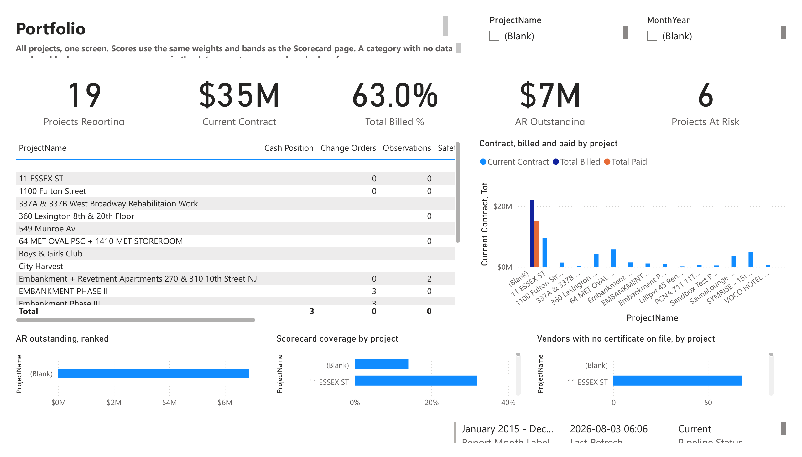
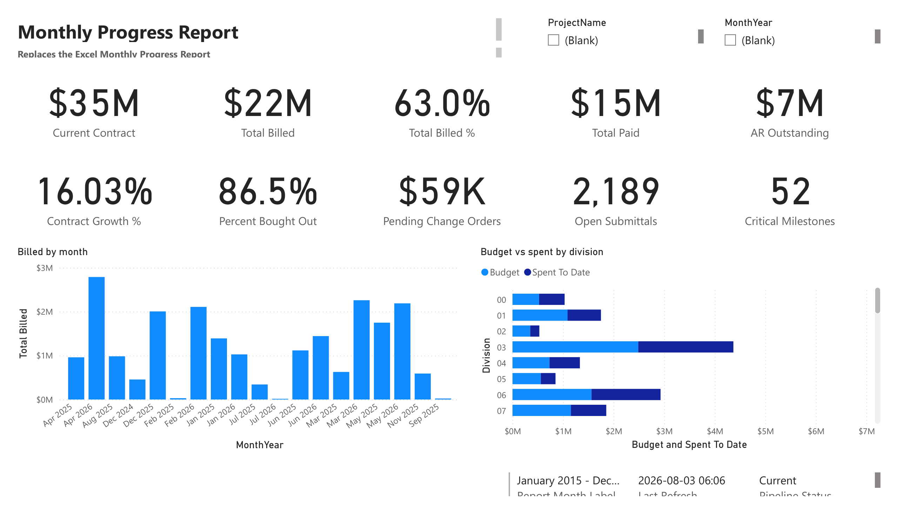
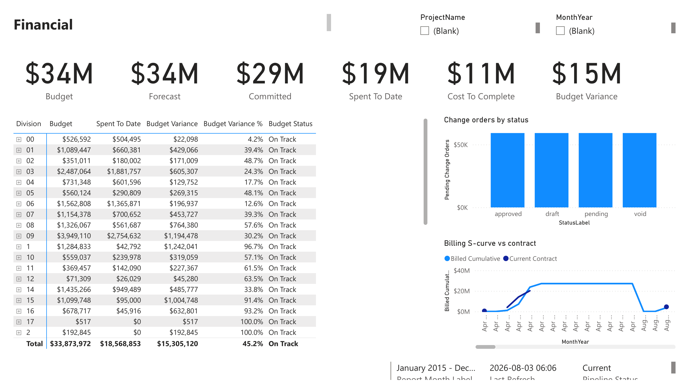
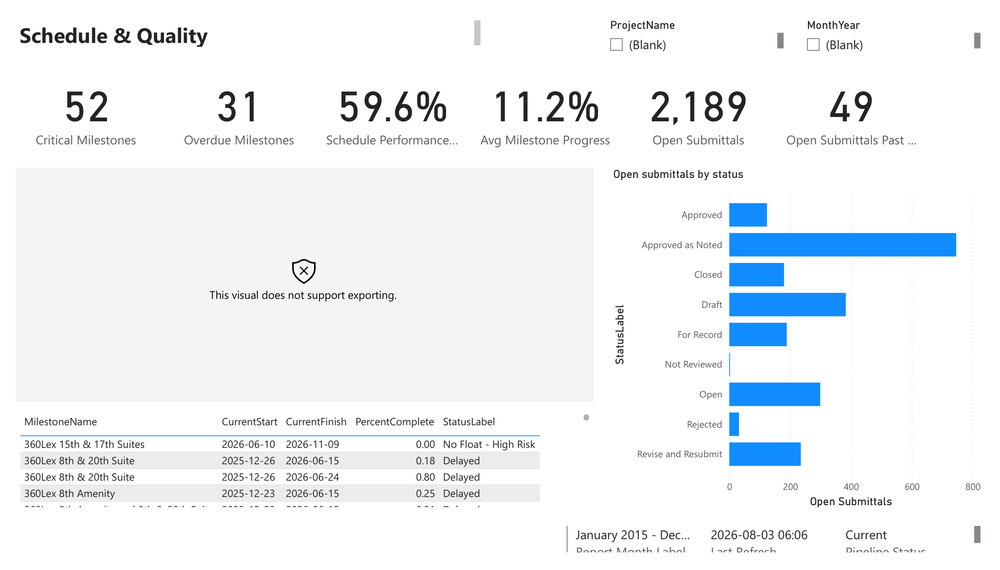
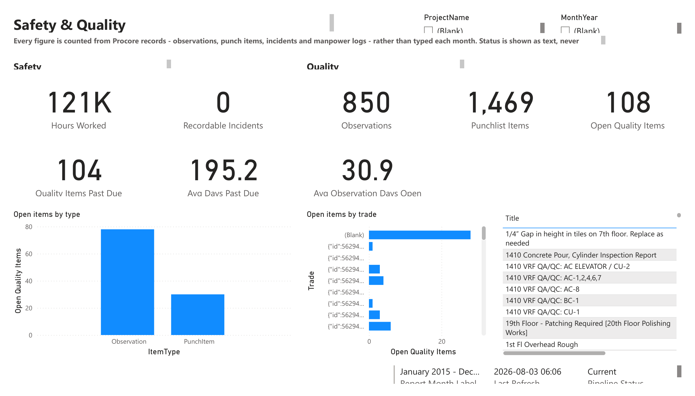
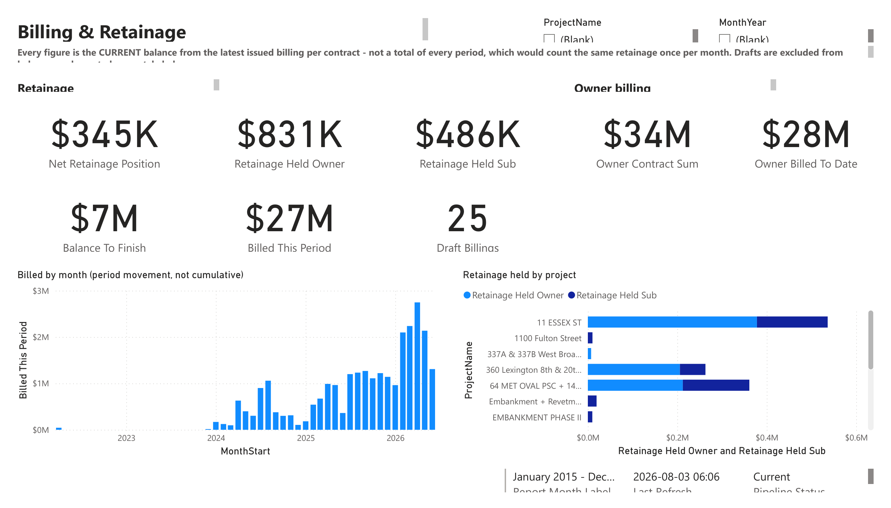
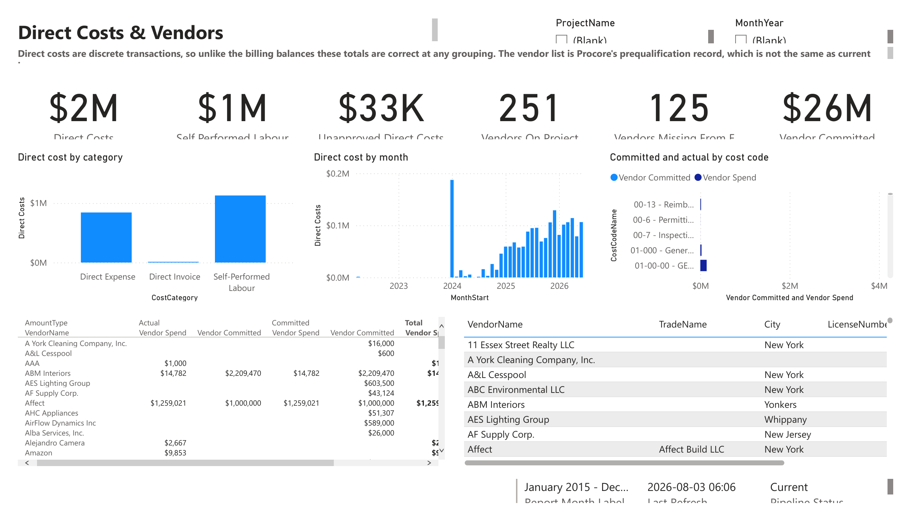
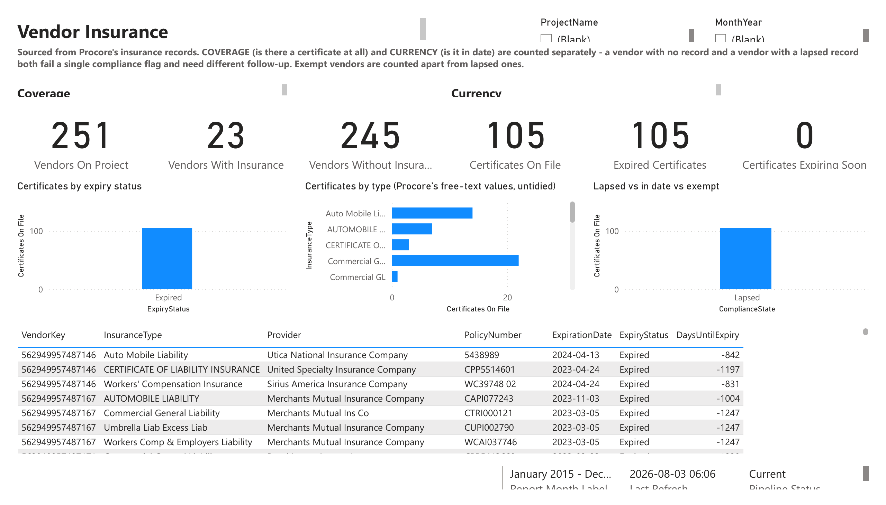
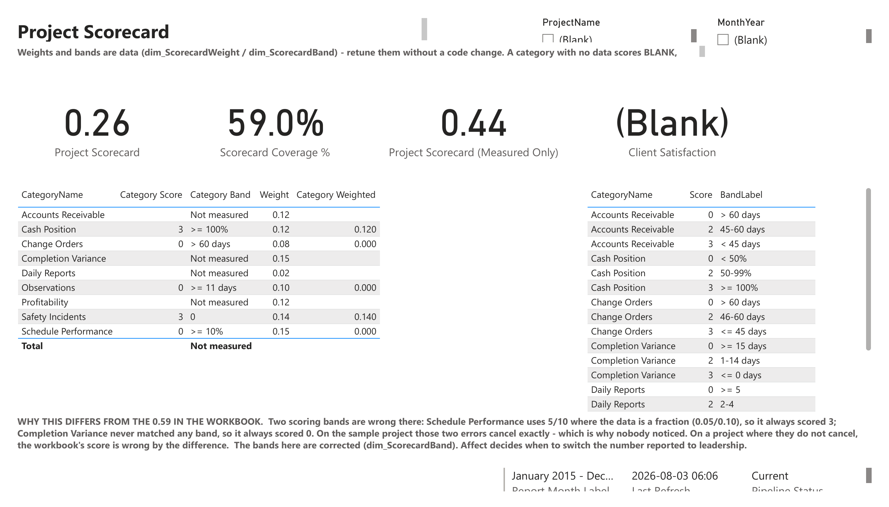
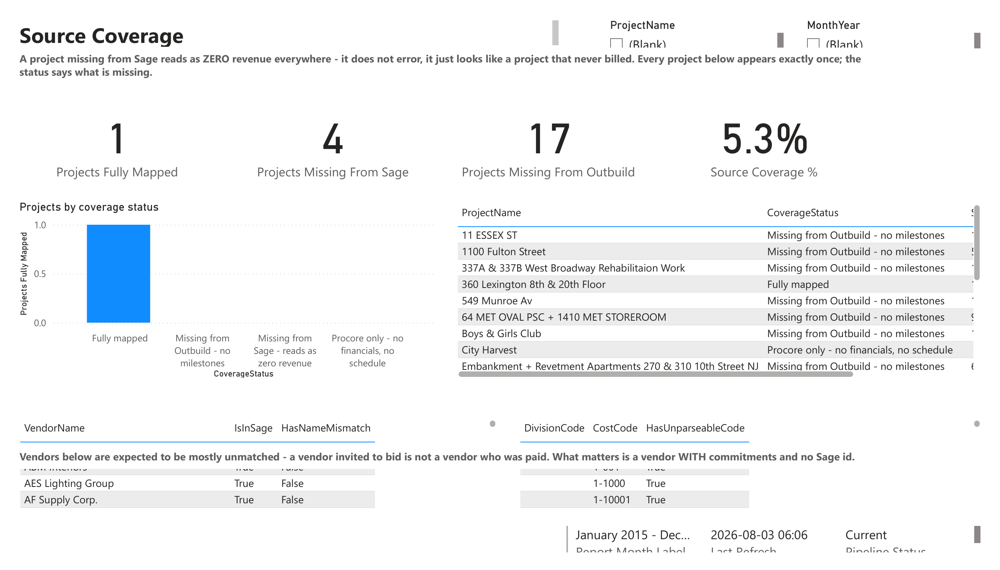

# Monthly Progress Report — the dashboard, page by page

Screenshots of the Power BI report that replaces Affect's Excel *Monthly Progress Report*.
One image per report page, split out of the PDF export.

| | |
|---|---|
| **Source report** | [`foundation/charley-dev/05-reports/Monthly Progress Report.Report`](../../../foundation/charley-dev/05-reports/Monthly%20Progress%20Report.Report) |
| **Semantic model** | `Affect Project Report` (Direct Lake over `CD_Gold_Lakehouse`) — [definition](../../../foundation/charley-dev/04-semantic_models) |
| **Exported** | 2026-08-03, last data refresh 06:06 |
| **Full PDF** | [`Monthly-Progress-Report.pdf`](Monthly-Progress-Report.pdf) |

**10 of the report's 12 pages are here.** `Project Detail` and `Data Quality` are
`HiddenInViewMode` — Project Detail is the drill-through target, Data Quality is the build's
own instrumentation — so neither appears in a PDF export. Both exist in the report
definition.

**Read the numbers as shape, not as truth.** This is the dev workspace: the `ProjectName` and
`MonthYear` slicers are unfiltered (showing `(Blank)`), Sage and Outbuild coverage is
incomplete, and several categories score blank because their source is not wired yet — which
the *Source Coverage* page exists to make visible rather than hide.

## The pages

| # | Page | What it answers |
|---|---|---|
| 1 | [Portfolio](pages/01-portfolio.png) | All projects on one screen — which ones are at risk |
| 2 | [Overview](pages/02-overview.png) | The one-page replacement for the Excel report's front tab |
| 3 | [Financial](pages/03-financial.png) | Budget vs committed vs spent, by division |
| 4 | [Schedule & Quality](pages/04-schedule.png) | Milestones and submittals — what is late |
| 5 | [Safety & Quality](pages/05-safety-quality.png) | Incidents, observations, punchlist |
| 6 | [Billing & Retainage](pages/06-billing-retainage.png) | Current balances, owner and sub retainage |
| 7 | [Direct Costs & Vendors](pages/07-direct-costs-vendors.png) | Committed vs actual by vendor and cost code |
| 8 | [Vendor Insurance](pages/08-vendor-insurance.png) | Who has a certificate, and whose is in date |
| 9 | [Project Scorecard](pages/09-scorecard.png) | The weighted score — with the workbook's bands corrected |
| 10 | [Source Coverage](pages/10-source-coverage.png) | Which projects are missing from which system |

---

### 1. Portfolio



Every project on one screen, scored with the same weights and bands as the Scorecard page.

**Tiles:** Projects Reporting · Current Contract · Total Billed % · AR Outstanding ·
Projects At Risk
**Visuals:** per-project score matrix (Cash Position, Change Orders, Observations, Safety) ·
contract / billed / paid by project · AR outstanding ranked · scorecard coverage by project ·
vendors with no certificate on file, by project

### 2. Overview



The direct replacement for the Excel front tab — ten KPI tiles and the two trends leadership
actually reads.

**Tiles:** Current Contract · Total Billed · Total Billed % · Total Paid · AR Outstanding ·
Contract Growth % · Percent Bought Out · Pending Change Orders · Open Submittals · Critical
Milestones
**Visuals:** billed by month · budget vs spent by division

### 3. Financial



**Tiles:** Budget · Forecast · Committed · Spent To Date · Cost To Complete · Budget Variance
**Visuals:** division table (budget, spent, variance, variance %, status band) · change orders
by status · billing S-curve against contract value

### 4. Schedule & Quality



**Tiles:** Critical Milestones · Overdue Milestones · Schedule Performance · Avg Milestone
Progress · Open Submittals · Open Submittals Past Due
**Visuals:** milestone table (start, finish, % complete, status band — *Delayed*, *No Float –
High Risk*) · open submittals by status

Milestones come from Outbuild, which most projects are missing — see page 10.

### 5. Safety & Quality



Every figure is counted from Procore records — observations, punch items, incidents, manpower
logs — rather than typed in each month.

**Tiles:** *Safety* — Hours Worked, Recordable Incidents. *Quality* — Observations, Punchlist
Items, Open Quality Items, Quality Items Past Due, Avg Days Past Due, Avg Observation Days Open
**Visuals:** open items by type · open items by trade · open item detail list

`Avg Days Past Due` of ~195 is a real finding, not a rendering artefact.

### 6. Billing & Retainage



Every figure is the **current balance from the latest issued billing per contract** — not a sum
over periods, which would count the same retainage once per month. Drafts are excluded.

**Tiles:** *Retainage* — Net Retainage Position, Held Owner, Held Sub. *Owner billing* — Owner
Contract Sum, Owner Billed To Date, Balance To Finish, Billed This Period, Draft Billings
**Visuals:** billed by month (period movement, not cumulative) · retainage held by project,
owner vs sub

### 7. Direct Costs & Vendors



Direct costs are discrete transactions, so unlike the billing balances these totals stay
correct at any grouping.

**Tiles:** Direct Costs · Self Performed Labour · Unapproved Direct Costs · Vendors On Project ·
Vendors Missing From ERP · Vendor Committed
**Visuals:** direct cost by category · direct cost by month · committed vs actual by cost code ·
vendor spend/committed table · vendor trade, city and licence table

The vendor list is Procore's **prequalification** record, which is not the same as the vendors
currently working — the D8 vendor/insurance automation depends on knowing the difference.

### 8. Vendor Insurance



**Coverage** (is there a certificate at all) and **currency** (is it in date) are counted
separately — a vendor with no record and a vendor with a lapsed record both fail one compliance
flag but need different follow-up. Exempt vendors are counted apart from lapsed ones.

**Tiles:** Vendors On Project · Vendors With Insurance · Vendors Without Insurance ·
Certificates On File · Expired Certificates · Certificates Expiring Soon
**Visuals:** certificates by expiry status · certificates by type (Procore's free-text values,
deliberately untidied) · lapsed vs in date vs exempt · certificate detail with days until expiry

245 of 251 vendors have no certificate on file, and every one of the 105 certificates that does
exist is expired. That is the page that pays for itself.

### 9. Project Scorecard



**Tiles:** Project Scorecard · Scorecard Coverage % · Project Scorecard (Measured Only) ·
Client Satisfaction
**Visuals:** category table (score, band, weight, weighted contribution) · the band reference
table itself

Weights and bands are **data** (`dim_ScorecardWeight` / `dim_ScorecardBand`) — retune them
without a code change. A category with no data scores blank rather than zero, so a missing feed
cannot quietly look like a bad month.

The page carries the explanation of why its score differs from the workbook's 0.59: Schedule
Performance compared 5/10 against a fraction, so it always scored 3; Completion Variance matched
no band, so it always scored 0. On the sample project those two errors cancel exactly — which is
why nobody noticed. Detail in
[`analysis/excel-tracker/`](../../../analysis/excel-tracker/).

### 10. Source Coverage



**Tiles:** Projects Fully Mapped · Projects Missing From Sage · Projects Missing From Outbuild ·
Source Coverage %
**Visuals:** projects by coverage status · per-project coverage table · vendor `IsInSage` /
`HasNameMismatch` · cost codes with unparseable codes

The reason this page exists: **a project missing from Sage reads as zero revenue everywhere —
it does not error, it just looks like a project that never billed.** 1 of 19 projects is fully
mapped today. This is the page to open first when a number looks wrong.

## Re-exporting

Open the report in the Fabric workspace → **File → Export → PDF**, then re-split:

```bash
python - <<'PY'
import fitz
names = ['portfolio','overview','financial','schedule','safety-quality','billing-retainage',
         'direct-costs-vendors','vendor-insurance','scorecard','source-coverage']
for i, p in enumerate(fitz.open('Monthly-Progress-Report.pdf')):
    p.get_pixmap(dpi=96).save(f'pages/{i+1:02d}-{names[i]}.png')
PY
```

Page order follows `definition/pages/pages.json` — if pages are added or reordered there,
update `names` to match.
